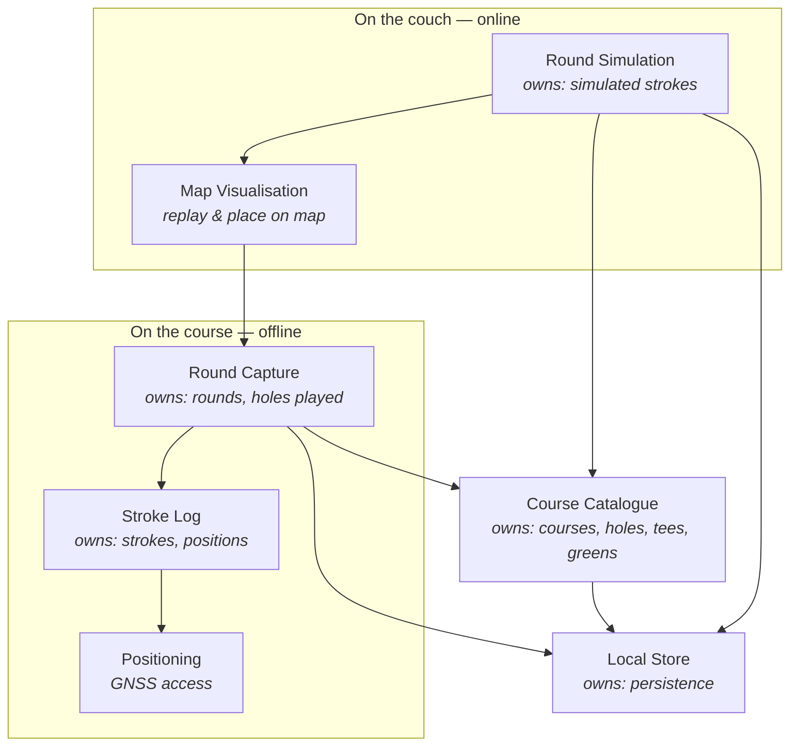

# GolfTrainer

Architecture documentation (arc42-inspired). This file is the architecture spine:
it is read first and updated last on every change. See `.claude/skills/timo_agentic_coding_process`
for the workflow that governs it.

> **Status:** Phase 1 — vision and context drafted. Sections marked **[OPEN]**
> are unresolved and must be answered before Phase 2 (bootstrap) starts.

---

## 1.1 System vision

GolfTrainer serves a golfer in two sharply different situations. **On the
course**, on a phone, they record every stroke as they play — no network, one
hand, minimal interaction. **On the couch**, online, they work on a map: they
replay a finished round, and they simulate a round in advance by placing
intended strokes spot by spot.

That split is the central architectural fact of this system. It is not one app
used in two places; it is one body of data reached through two contexts with
opposite constraints.

| | On the course | On the couch |
|---|---|---|
| Device | Phone, in hand, in sunlight | Phone or larger screen, relaxed |
| Network | Assume none | Assume yes |
| Map | None at all — "car mode" (TD3) | The whole point |
| Interaction budget | Seconds, gloved, one hand | Unbounded |
| Activities | Capture strokes (UC1) | Review (UC2), simulate (UC3) |

### Main use cases

| # | Actor | Context | Goal |
|---|-------|---------|------|
| UC1 | Golfer | Course, offline | Capture each stroke while playing, with minimal interaction and no network |
| UC2 | Golfer | Couch, online | Replay a completed round on a map, seeing where each stroke started and ended |
| UC3 | Golfer | Couch, online | Simulate a round in advance by placing intended strokes on a map, spot by spot |
| UC4 | Golfer | Couch, online | Compare a played round against the simulation for that hole *(candidate — see [OPEN-5])* |

### Value proposition

Golfers already carry a phone but lose the shot-by-shot record of a round: paper
scorecards capture strokes but not positions, and map-based apps stop working
where cell coverage does. Without GolfTrainer the spatial record of a round —
where the ball actually went — is lost by the time the golfer reaches the
clubhouse, and the simulated round the golfer worked out at home has nothing to
be measured against.

### Quality goals

Ordered — earlier goals win when they conflict.

| # | Goal | Why it matters | How we'll know |
|---|------|----------------|----------------|
| QG1 | **Offline capability on the course** | Courses have poor or no reception. A capture that needs the network is a capture that fails. | Capturing a full round works end to end in airplane mode; nothing is lost or degraded |
| QG2 | **Ease of use during play** | Capture competes with playing golf: one hand, gloves, bright sunlight, a group waiting. | Recording a stroke is a small, fixed number of interactions; no typing required mid-round |
| QG3 | **Durability of captured data** | A round is unrepeatable. Losing it is worse than never capturing it. | Round survives app kill, battery death, and OS eviction mid-round |

**Explicitly not a goal:** map availability offline. Map display is an
online-only feature by decision. On the course the golfer sees "car mode"
instead — large buttons, no map at all (TD3).

---

## 1.2 Stakeholders

| Role | Interest | What they need from the system |
|------|----------|--------------------------------|
| Golfer (primary user) | Records and reviews their own rounds; plans holes | Fast capture that never fails offline; a map review that is worth the effort of capturing |
| Playing partners | Are waiting while the user operates the app | That capture takes seconds, not attention — indirectly a hard usability constraint |
| Maintainer (you + agent) | Evolves the system over years | Clear component boundaries, quality signals in CI, an architecture doc that matches the code |
| Map/basemap provider | Serves tiles and imagery, under a licence and quota | Attribution honoured, terms respected, no bulk tile scraping — constrains QG-not-goal above |
| Data protection (self, as controller) | Location traces are personal data | Local-first storage, explicit control over anything leaving the device |

---

## 1.3 System context

Green = works offline and is on the QG1 critical path. Orange = online only; the
system must degrade cleanly without it.

---

## 1.4 Business components

Draft — business capabilities, not frameworks. Refine once the open questions
are answered.

**Boundary rule (non-negotiable):** nothing in the *on the course* group may
depend on anything in the *on the couch* group, or on any online component.
Dependencies cross that line in one direction only — Map Visualisation reads
Round Capture's data, never the reverse. That single rule is what makes QG1
hold rather than merely be asserted, and the agentic review checks it
explicitly on every change.

Note that *Course Catalogue* sits outside both groups and is reachable from
both — it is therefore on the offline critical path, which constrains where its
data can come from ([OPEN-4]).

---

## 1.5 Technology choices

| # | Decision | Chosen | Alternatives considered | Rationale |
|---|----------|--------|-------------------------|-----------|
| TD1 | Platform | Installable **PWA** | Native (Kotlin/Swift), Flutter, React Native | One codebase, no app store, no release gatekeeper. Service workers and the Geolocation API cover everything QG1 and UC1 need |
| TD2 | Language & framework | **Vanilla JS (ES modules), HTML, CSS** — no framework | React, Svelte, Lit, Vue | No build step, no toolchain rot, no framework upgrade treadmill. The UI is small and mostly non-reactive; a framework would be weight without leverage |
| TD3 | On-course UI | **"Car mode"** — large tap targets, no map | Map-on-course with pre-cached tiles | Directly serves QG2 (gloved, one hand, sunlight). Also removes the last reason for the offline path to touch anything online — the boundary rule in §1.4 now holds by construction |
| TD4 | Offline shell | **Service worker**, precached app shell | Cache-less, online-first | The app must launch from a cold start in airplane mode. Non-negotiable for QG1 |
| TD5 | Persistence | **IndexedDB** | localStorage, OPFS | localStorage is ~5 MB, synchronous, and string-only — it would block the capture UI and lose structure. IndexedDB is transactional and survives eviction better, serving QG3 |
| TD6 | Positioning | **Geolocation API** (`watchPosition`) | Device-specific GNSS APIs | The only option available to a PWA; sufficient for stroke positions |
| TD7 | Basemap / tiles | **[OPEN-7]** | — | Couch-only, so it does not affect QG1. Deferred until UC2/UC3 are built |

### TD8 — Storage durability on iOS (serves QG3)

| Decision | Chosen | Rationale |
|---|---|---|
| TD8 | **Require installation to the home screen, and request persistent storage** | The two conditions that together take iOS eviction off the table |

WebKit's seven-day cap on script-writable storage (IndexedDB, localStorage,
service worker registrations) applies to origins **in Safari** that have seen no
user interaction across seven days of Safari use. Two documented carve-outs
apply to us:

1. **Home-screen web apps are exempt.** An installed PWA is not part of Safari,
   keeps its own days-of-use counter, and its first-party data is not deleted
   under this rule.
2. **Persistent-mode origins are skipped by eviction.** Since Safari 17 the
   Storage API is fully supported; `navigator.storage.persist()` moves an origin
   out of the default best-effort mode, after which only the user can clear it.

**Consequences for the build — both are functional requirements, not polish:**

- Installation is part of onboarding, not an optional prompt. A round captured
  in a *browser tab* is the case the seven-day rule still governs.
- Call `navigator.storage.persist()` at first run and check `persisted()`. If
  persistence is refused, say so plainly rather than pretending the round is safe.

**Residual risk, honestly stated:** neither carve-out protects against
device-level storage pressure, and iOS still enforces a per-origin quota. Round
export therefore remains worth building — but as insurance against a rare case,
not as a workaround for expected weekly data loss.

---

## Open questions

### Resolved

- **Platform** — mobile device with GPS, as an installable PWA built in vanilla
  JS/HTML/CSS. Recorded as TD1/TD2.
- **Simulation context** — UC3 is a couch activity, online and map-first, not
  something done at the course. Reflected in §1.1 and §1.4.
- **On-course screen** — "car mode": large buttons, no map. Recorded as TD3.

### Still open

| # | Question | Why it blocks |
|---|----------|---------------|
| OPEN-3 | How is a stroke recorded? One tap at the ball's position, or start + end per stroke? Is club, lie, or penalty captured too? | Defines the core entity and the interaction budget for QG2. *Deferred by decision — to be settled in the UC1 use-case spec (Phase 3), not here* |
| OPEN-4 | Where does course/hole data come from — a provider, drawn by the golfer while simulating, or inferred from captured positions? | Course Catalogue is on the offline critical path, so an online-only source would breach the boundary rule |
| OPEN-5 | Is plan-vs-actual comparison (UC4) in scope? | Determines whether Round Capture and Round Simulation share a stroke model or stay fully decoupled |
| OPEN-6 | Single device only, or does a round ever sync to another device or a backend? | Local-only removes an entire external system and all its privacy surface |
| OPEN-7 | Which basemap/tile provider for the couch views — OSM-based (Leaflet + a tile host), Mapbox, Google? Satellite imagery or vector? | Licensing and attribution obligations (see §1.2). Couch-only, so it does not affect QG1 and can wait until UC2 |
