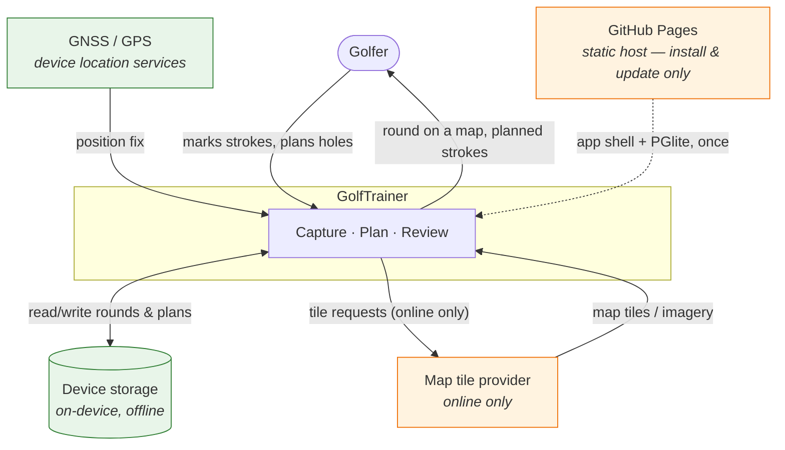
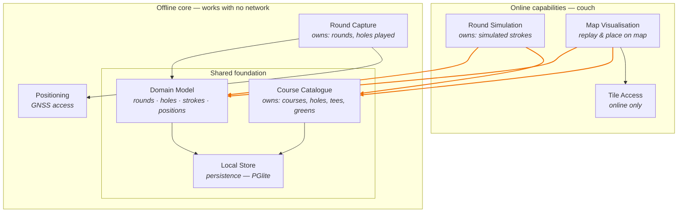

# GolfTrainer

Architecture documentation (arc42-inspired). This file is the architecture spine:
it is read first and updated last on every change. See `.claude/skills/timo_agentic_coding_process`
for the workflow that governs it.

> **Status:** Phase 2 complete — bootstrapped, deployed to GitHub Pages, every
> quality signal in CI. The shell has a burger menu; of its four destinations
> only "load new version" is implemented. No use case is built yet — the capture
> screen (UC1) waits on OPEN-3. Questions marked **[OPEN]** are unresolved.

---

## 1.1 System vision

GolfTrainer serves a golfer in two sharply different situations. **On the
course**, on a phone, they record every stroke as they play — no network, one
hand, minimal interaction. **On the couch**, online, they work on a map: they
replay a finished round, and they simulate a round in advance by placing
intended strokes spot by spot.

That split is the central architectural fact of this system. It is not one app
used in two places; it is one body of data reached through two contexts with
opposite constraints.

| | On the course | On the couch |
|---|---|---|
| Device | Phone, in hand, in sunlight | Phone or larger screen, relaxed |
| Network | Assume none | Assume yes |
| Map | None at all — "car mode" (TD3) | The whole point |
| Interaction budget | Seconds, gloved, one hand | Unbounded |
| Activities | Capture strokes (UC1) | Review (UC2), simulate (UC3) |

### Main use cases

| # | Actor | Context | Goal |
|---|-------|---------|------|
| UC1 | Golfer | Course, offline | Capture each stroke while playing, with minimal interaction and no network |
| UC2 | Golfer | Couch, online | Replay a completed round on a map, seeing where each stroke started and ended |
| UC3 | Golfer | Couch, online | Simulate a round in advance by placing intended strokes on a map, spot by spot |
| UC4 | Golfer | Couch, online | Compare a played round against the simulation for that hole *(candidate — see [OPEN-5])* |

### Value proposition

Golfers already carry a phone but lose the shot-by-shot record of a round: paper
scorecards capture strokes but not positions, and map-based apps stop working
where cell coverage does. Without GolfTrainer the spatial record of a round —
where the ball actually went — is lost by the time the golfer reaches the
clubhouse, and the simulated round the golfer worked out at home has nothing to
be measured against.

### Quality goals

Ordered — earlier goals win when they conflict.

| # | Goal | Why it matters | How we'll know |
|---|------|----------------|----------------|
| QG1 | **Offline capability on the course** | Courses have poor or no reception. A capture that needs the network is a capture that fails. | Capturing a full round works end to end in airplane mode; nothing is lost or degraded |
| QG2 | **Ease of use during play** | Capture competes with playing golf: one hand, gloves, bright sunlight, a group waiting. | Recording a stroke is a small, fixed number of interactions; no typing required mid-round |
| QG3 | **Durability of captured data** | A round is unrepeatable. Losing it is worse than never capturing it. | Round survives app kill, battery death, and OS eviction mid-round |

**Explicitly not a goal:** map availability offline. Map display is an
online-only feature by decision. On the course the golfer sees "car mode"
instead — large buttons, no map at all (TD3).

---

## 1.2 Stakeholders

| Role | Interest | What they need from the system |
|------|----------|--------------------------------|
| Golfer (primary user) | Records and reviews their own rounds; plans holes | Fast capture that never fails offline; a map review that is worth the effort of capturing |
| Playing partners | Are waiting while the user operates the app | That capture takes seconds, not attention — indirectly a hard usability constraint |
| Maintainer (you + agent) | Evolves the system over years | Clear component boundaries, quality signals in CI, an architecture doc that matches the code |
| Map/basemap provider | Serves tiles and imagery, under a licence and quota | Attribution honoured, terms respected, no bulk tile scraping — constrains QG-not-goal above |
| Data protection (self, as controller) | Location traces are personal data | Local-first storage, explicit control over anything leaving the device |

---

## 1.3 System context



Green = works offline and is on the QG1 critical path. Orange = online only; the
system must degrade cleanly without it.

The host is dashed because it is reached **before** the round, never during one:
it delivers the app and its updates, and after the service worker has installed
(TD4) the app owes it nothing. A round captured while the host is unreachable is
a round captured normally. Its one hard requirement is HTTPS — service workers
and the Geolocation API both demand a secure context, so QG1 and UC1 rest on it
(TD11).

---

## 1.4 Business components

Business capabilities, not frameworks.

The two contexts of §1.1 are **not two separate systems**. They are two sets of
capabilities over **one shared domain model and one shared store**. A simulated
stroke and a captured stroke are the same kind of thing; a course is the same
course whether it is being played or planned. Duplicating that model per context
would mean maintaining two truths about a golf round — and would make UC4
(plan versus actual) impossible to express.

What separates the contexts is therefore not the data. It is the **direction of
dependency**.



Orange edges cross the context line. **Every one of them points downward.**

### The dependency rule (non-negotiable)

> **Online capabilities may depend on offline capabilities. Never the reverse.**

Concretely: Round Simulation and Map Visualisation read and write the shared
Domain Model. Round Capture must never reference Round Simulation, Map
Visualisation, or Tile Access — not by import, not by event, not by a shared
type that drags an online concern into the offline core.

This is what makes QG1 hold. Remove every online capability from the build and
the offline core must still compile and run — that is the acceptance test for
the rule, and the agentic review (§5.2) checks it on every change.

The shared foundation is by definition on the offline critical path. That
constrains Course Catalogue in particular: its data must be available with no
network, which is what makes [OPEN-4] an architectural question rather than a
sourcing preference.

---

## 1.5 Technology choices

| # | Decision | Chosen | Alternatives considered | Rationale |
|---|----------|--------|-------------------------|-----------|
| TD1 | Platform | Installable **PWA** | Native (Kotlin/Swift), Flutter, React Native | One codebase, no app store, no release gatekeeper. Service workers and the Geolocation API cover everything QG1 and UC1 need |
| TD2 | Language & framework | **Vanilla JS (ES modules), HTML, CSS** — no framework | React, Svelte, Lit, Vue | No build step, no toolchain rot, no framework upgrade treadmill. The UI is small and mostly non-reactive; a framework would be weight without leverage |
| TD3 | On-course UI | **"Car mode"** — large tap targets, no map | Map-on-course with pre-cached tiles | Directly serves QG2 (gloved, one hand, sunlight). Also removes the last reason for the offline core to reach for an online capability, so the dependency rule in §1.4 costs nothing to obey |
| TD4 | Offline shell | **Service worker**, precached app shell | Cache-less, online-first | The app must launch from a cold start in airplane mode. Non-negotiable for QG1 |
| TD5 | Persistence | **PGlite** (Postgres compiled to WASM, `@electric-sql/pglite`) | Raw IndexedDB, localStorage, SQLite/wa-sqlite | One relational schema shared by both contexts (§1.4), real SQL for the spatial and plan-vs-actual queries UC2/UC4 need, and transactions that serve QG3. Dual-licensed Apache-2.0 / PostgreSQL |
| TD6 | Positioning | **Geolocation API** (`watchPosition`) | Device-specific GNSS APIs | The only option available to a PWA; sufficient for stroke positions |
| TD7 | Basemap / tiles | **[OPEN-7]** | — | Couch-only, so it does not affect QG1. Deferred until UC2/UC3 are built |
| TD9 | PGlite delivery | **Served from our own origin and precached; reproduced into `vendor/` by `npm run vendor`, not committed** | CDN import at runtime (jsDelivr); committing `vendor/` to git | A CDN fetch on the offline critical path would breach the dependency rule in §1.4 — the WASM must be on the device before the first tee. It is *generated* rather than committed because it is 17 MB of binary per version, and git history cannot shed it on the next upgrade |
| TD10 | Enforcing the dependency rule | **ESLint, failing the build** | Convention and review; a custom dependency-graph checker | An architecture rule that only lives in prose erodes. `no-restricted-imports` blocks imports from `src/online/` into `src/offline/`, and `no-restricted-globals` blocks `fetch`/`XMLHttpRequest`/`WebSocket`/`EventSource` there — so the offline core cannot quietly grow a network call either |
| TD11 | Hosting | **GitHub Pages**, deployed from CI on the default branch | A VPS; Netlify/Vercel; Cloudflare Pages | Static hosting over HTTPS is all a PWA needs — no server, no runtime, nothing to operate. HTTPS is not optional: service workers and the Geolocation API both require a secure context, so QG1 and UC1 depend on it |
| TD12 | Path resolution | **Every path relative, none rooted at `/`** | A hard-coded base path; a custom domain at the root | GitHub Pages serves a project repository under `/<repo>/`. An absolute path resolves outside the app there — including the service worker scope and the PGlite WASM. Relative paths work at any mount point, so the app is not coupled to where it is published |
| TD13 | Where navigation lives | **`src/shell/` — a third zone, neither offline core nor online capability** | Putting the menu in `src/offline/`; splitting it per context | The burger menu leads to Round Capture (offline) *and* Round Simulation (online), so it belongs to neither. It is precached and opens on the course, so it carries the offline constraints anyway: no network calls, and no *static* import of an online capability. A dynamic `import()` at the moment the golfer taps an online destination is the intended escape hatch, and ESLint restricts only static imports |

### Consequences of TD5 (PGlite)

Recorded because they are load-bearing, not incidental:

- **PGlite persists to IndexedDB on our target platform.** Its OPFS backend
  requires a Web Worker and is not supported by Safari. So the durability story
  underneath is still IndexedDB — TD8 below governs it unchanged.
- **~3 MB gzipped of WASM sits on the offline critical path.** It must be
  precached by the service worker (TD4) and present before the round starts, not
  fetched lazily. A cold start in airplane mode that downloads a database engine
  is a failed QG1.
- **This is the app's first and only runtime dependency.** Keeping it the only
  one is a deliberate stance: the runtime surface stays auditable, and dev
  tooling (§2.2) stays strictly dev-time.
- **The domain model is now a SQL schema**, so it needs migrations from the
  first commit that writes a table. Rounds captured under an old schema must
  survive an app update — QG3 covers upgrades, not just crashes.

### TD8 — Storage durability on iOS (serves QG3)

| Decision | Chosen | Rationale |
|---|---|---|
| TD8 | **Require installation to the home screen, and request persistent storage** | The two conditions that together take iOS eviction off the table |

WebKit's seven-day cap on script-writable storage (IndexedDB, localStorage,
service worker registrations) applies to origins **in Safari** that have seen no
user interaction across seven days of Safari use. Two documented carve-outs
apply to us:

1. **Home-screen web apps are exempt.** An installed PWA is not part of Safari,
   keeps its own days-of-use counter, and its first-party data is not deleted
   under this rule.
2. **Persistent-mode origins are skipped by eviction.** Since Safari 17 the
   Storage API is fully supported; `navigator.storage.persist()` moves an origin
   out of the default best-effort mode, after which only the user can clear it.

**Consequences for the build — both are functional requirements, not polish:**

- Installation is part of onboarding, not an optional prompt. A round captured
  in a *browser tab* is the case the seven-day rule still governs.
- Call `navigator.storage.persist()` at first run and check `persisted()`. If
  persistence is refused, say so plainly rather than pretending the round is safe.

**Residual risk, honestly stated:** neither carve-out protects against
device-level storage pressure, and iOS still enforces a per-origin quota. Round
export therefore remains worth building — but as insurance against a rare case,
not as a workaround for expected weekly data loss.

---

## 2. Build, structure and quality signals

### 2.1 Repository layout

The directory structure *is* the dependency rule. `src/offline/` and
`src/online/` are not a filing convention — they are the two halves of §1.4,
and the line between them is enforced (TD10).

```
index.html              app shell
sw.js                   service worker — precaches shell + PGlite (TD4)
app-shell.json          precache list; verified against disk by a test
manifest.webmanifest    installability, which TD8 depends on

src/
  main.js               composition root; also the walking skeleton (TD4/5/8)
  shell/                navigation — belongs to neither context (TD13)
    menu.js             burger menu behaviour
    app-update.js       "load new version": clear caches, reinstall
  offline/              works with no network — may not import from online/
    shared/             the shared foundation of §1.4
      store/            PGlite connection + schema migrations
      durability/       TD8: request persistence, report refusal honestly
  online/               may import from offline/ — currently empty

tools/                  vendor script, dev server
test/                   unit tests (node:test)
e2e/                    offline verification (Playwright)
vendor/                 generated by `npm run vendor`, not committed
```

### 2.2 Quality signals

Every signal answers a question that reading the code cannot, and all of them
run in CI on every push. `npm run signals` runs the lot locally.

| # | Signal | Tool | Notes |
|---|--------|------|-------|
| 2.2.1 | Style | ESLint + Prettier | `CLAUDE.md` is excluded from Prettier so the architecture spine keeps readable diffs |
| 2.2.2 | Static bug patterns | TypeScript (`checkJs`) over JSDoc | Type safety with no build step — the code stays plain JS the browser runs directly (TD2) |
| 2.2.3 | Duplication | jscpd | |
| 2.2.4 | Security patterns | eslint-plugin-security | |
| 2.2.5 | Vulnerable dependencies | `npm audit` | Trivially small surface: one runtime dependency |
| 2.2.6 | **Architecture conformance** | ESLint (TD10) | The dependency rule of §1.4, enforced rather than reviewed |
| 2.2.7 | **Offline capability** | Playwright | QG1 verified in a real browser: load, cut the network, close the page, reopen it |
| 2.2.8 | **Deployment shape** | Playwright | The same offline suite against the assembled site mounted at `/golftrainer/`, the layout GitHub Pages actually serves (TD12) |

Signals 2.2.6, 2.2.7 and 2.2.8 are additions to the standard set, and they are
the ones that matter most here — they are the only ones that check the claims
the whole architecture rests on.

### 2.3 Deployment

```
npm run site   →  _site/   →  GitHub Pages
```

`tools/build-site.mjs` copies exactly the files the two precache manifests
name, plus `sw.js` and the vendor manifest. Nothing is compiled or bundled, so
TD2 still holds: what is served is what is in the repository.

Deriving the deployment from the precache list keeps one list honest instead of
two. A file that is not precached does not work on the course, so publishing it
would be pointless — and a file that is precached but not published breaks the
service worker's install outright.

### 2.4 Three traps this bootstrap closes

Both are silent failures: they look fine in development and break on the course.

- **A stale precache list.** With no build step there is nothing to derive the
  service worker's file list from, so `app-shell.json` is hand-maintained. A
  module added to `src/` but not listed still works locally — the dev server
  serves it — and then fails where there is no network. `test/app-shell.test.js`
  compares the list against the filesystem in both directions.
- **A service worker that has activated but is not yet in control.** A worker
  reports `activated` before `clients.claim()` resolves, and in that window it
  intercepts nothing. Offline tests must wait on
  `navigator.serviceWorker.controller`, or they fail for reasons unrelated to
  being offline.
- **A manifest that does not list itself.** `vendor/pglite/assets.json` names
  every PGlite file but not itself, so the first deployment omitted it, the
  service worker's install fetch 404'd, and *nothing* was cached. The app was
  fine at the root and broken under a subpath. Signal 2.2.8 caught it; both
  manifests are now precached and deployed.
- **An update button that bricks the app.** "Load new version" deletes the
  precache. Run it with no network and there is nothing to reinstall from: the
  app is dead until the golfer finds reception — the exact failure QG1 exists
  to prevent. Being offline is therefore a hard refusal, not a warning, and the
  worker is unregistered rather than merely emptied so the reload rebuilds the
  precache instead of quietly running network-only.

---

## Open questions

### Resolved

- **Platform** — mobile device with GPS, as an installable PWA built in vanilla
  JS/HTML/CSS. Recorded as TD1/TD2.
- **Simulation context** — UC3 is a couch activity, online and map-first, not
  something done at the course. Reflected in §1.1 and §1.4.
- **On-course screen** — "car mode": large buttons, no map. Recorded as TD3.
- **Context coupling** — the online and offline contexts share one domain model
  and one store; they are separated by dependency direction only. Recorded as
  the dependency rule in §1.4.
- **Database** — PGlite. Recorded as TD5/TD9.

### Still open

| # | Question | Why it blocks |
|---|----------|---------------|
| OPEN-3 | How is a stroke recorded? One tap at the ball's position, or start + end per stroke? Is club, lie, or penalty captured too? | Defines the core entity and the interaction budget for QG2. *Deferred by decision — to be settled in the UC1 use-case spec (Phase 3), not here* |
| OPEN-4 | Where does course/hole data come from — a provider, drawn by the golfer while simulating, or inferred from captured positions? | Course Catalogue is in the shared foundation and therefore on the offline critical path. An online-only source would breach the dependency rule |
| OPEN-5 | Is plan-vs-actual comparison (UC4) in scope, and for which release? | No longer an architectural question — the shared domain model (§1.4) already makes it expressible. Now purely a scope/priority call |
| OPEN-6 | Single device only, or does a round ever sync to another device or a backend? | Local-only removes an entire external system and all its privacy surface |
| OPEN-7 | Which basemap/tile provider for the couch views — OSM-based (Leaflet + a tile host), Mapbox, Google? Satellite imagery or vector? | Licensing and attribution obligations (see §1.2). Couch-only, so it does not affect QG1 and can wait until UC2 |
