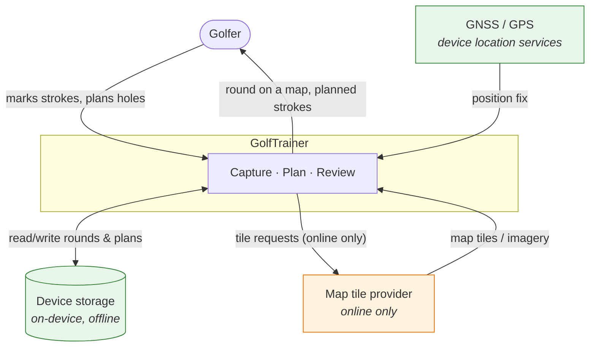
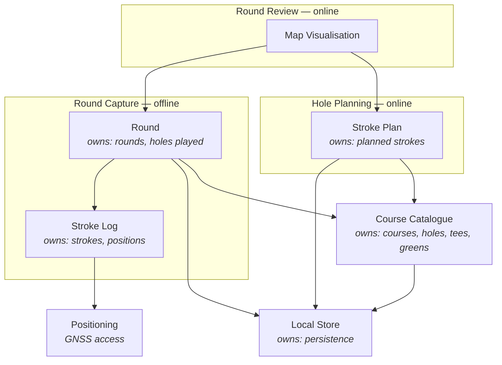

# GolfTrainer

Architecture documentation (arc42-inspired). This file is the architecture spine:
it is read first and updated last on every change. See `.claude/skills/timo_agentic_coding_process`
for the workflow that governs it.

> **Status:** Phase 1 — vision and context drafted. Sections marked **[OPEN]**
> are unresolved and must be answered before Phase 2 (bootstrap) starts.

---

## 1.1 System vision

GolfTrainer lets a golfer record every stroke of a round on the course and
review the round afterwards on a map, and lets the same golfer plan a hole
stroke by stroke on a map before playing it. Capture happens where reception is
worst — in the middle of a course — so the capture path works fully offline; the
map view is an online-only feature layered on top of it.

### Main use cases

| # | Actor | Goal |
|---|-------|------|
| UC1 | Golfer | Capture each stroke while playing a round, without network and with minimal interaction |
| UC2 | Golfer | Review a completed round on a map, seeing where each stroke started and ended |
| UC3 | Golfer | Plan a hole in advance by placing intended strokes on a map |
| UC4 | Golfer | Compare a played round against the plan for that hole *(candidate — see [OPEN-5])* |

### Value proposition

Golfers already carry a phone but lose the shot-by-shot record of a round: paper
scorecards capture strokes but not positions, and map-based apps stop working
where cell coverage does. Without GolfTrainer the spatial record of a round —
where the ball actually went, versus where it was meant to go — is lost by the
time the golfer reaches the clubhouse. Planning and reality are never compared.

### Quality goals

Ordered — earlier goals win when they conflict.

| # | Goal | Why it matters | How we'll know |
|---|------|----------------|----------------|
| QG1 | **Offline capability on the course** | Courses have poor or no reception. A capture that needs the network is a capture that fails. | Capturing a full round works end to end in airplane mode; nothing is lost or degraded |
| QG2 | **Ease of use during play** | Capture competes with playing golf: one hand, gloves, bright sunlight, a group waiting. | Recording a stroke is a small, fixed number of interactions; no typing required mid-round |
| QG3 | **Durability of captured data** | A round is unrepeatable. Losing it is worse than never capturing it. | Round survives app kill, battery death, and OS eviction mid-round |

**Explicitly not a goal (for now):** map availability offline. Map display is an
online-only feature by decision — see [OPEN-2] for what the golfer sees on the
course instead.

---

## 1.2 Stakeholders

| Role | Interest | What they need from the system |
|------|----------|--------------------------------|
| Golfer (primary user) | Records and reviews their own rounds; plans holes | Fast capture that never fails offline; a map review that is worth the effort of capturing |
| Playing partners | Are waiting while the user operates the app | That capture takes seconds, not attention — indirectly a hard usability constraint |
| Maintainer (you + agent) | Evolves the system over years | Clear component boundaries, quality signals in CI, an architecture doc that matches the code |
| Map/basemap provider | Serves tiles and imagery, under a licence and quota | Attribution honoured, terms respected, no bulk tile scraping — constrains QG-not-goal above |
| Data protection (self, as controller) | Location traces are personal data | Local-first storage, explicit control over anything leaving the device |

---

## 1.3 System context

Green = works offline and is on the QG1 critical path. Orange = online only; the
system must degrade cleanly without it.

---

## 1.4 Business components

Draft — business capabilities, not frameworks. Refine once [OPEN-1..5] are answered.

**Boundary rule:** nothing in *Round Capture* may depend on *Map Visualisation*
or on any online component. That dependency direction is what makes QG1 hold,
and the agentic review checks it explicitly.

---

## 1.5 Technology choices

**[OPEN]** — no technology decided yet. Deliberately deferred until [OPEN-1]
(platform) is answered, since it determines the whole stack. Decisions land here
as short ADR rows: `Decision | Chosen | Alternatives considered | Rationale`.

---

## Open questions

| # | Question | Why it blocks |
|---|----------|---------------|
| OPEN-1 | Platform: mobile app (which — native/cross-platform?), or installable web app? | Determines the entire stack; QG1 and GNSS access constrain the options sharply |
| OPEN-2 | On the course with no network, what does the golfer see when marking a stroke — a bare "mark my position" button, a blank canvas, or cached tiles from a pre-round download? | Decides whether "map = online only" also means "no map on the course", and shapes the core capture screen |
| OPEN-3 | How is a stroke recorded? One tap at the ball's position (start), or start + end per stroke? Is club/lie/penalty captured too? | Defines the core entity and the interaction budget for QG2 |
| OPEN-4 | Where does course/hole data come from — a provider, drawn by the user during planning, or inferred from the captured positions? | Adds or removes an external system from §1.3 |
| OPEN-5 | Is plan-vs-actual comparison (UC4) in scope, or are planning and capture independent features? | Determines whether the two components share a model or stay decoupled |
| OPEN-6 | Single device, single golfer only — or does a round ever need to sync to another device or a backend? | Local-only removes an entire external system and all its privacy surface |
