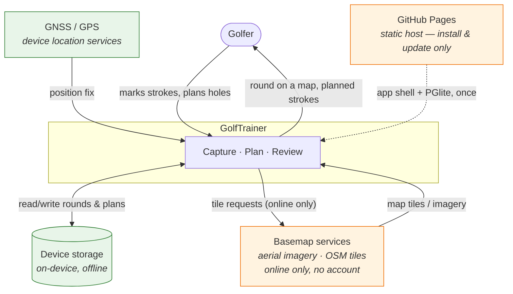
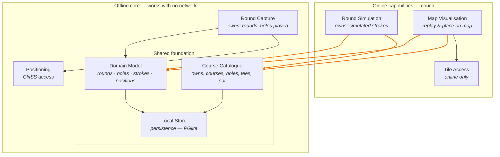

# GolfTrainer

Architecture documentation (arc42-inspired). This file is the architecture spine:
it is read first and updated last on every change. See `.claude/skills/timo_agentic_coding_process`
for the workflow that governs it.

> **Status:** All four use cases are built and covered by tests —
> [UC5](docs/use%20cases/UC5-manage-courses.md) courses,
> [UC1](docs/use%20cases/UC1-track-round.md) capture,
> [UC2](docs/use%20cases/UC2-show-round.md) review,
> [UC3](docs/use%20cases/UC3-plan-round.md) planning. A full round can be
> captured in airplane mode and replayed on a map afterwards. Every quality
> signal runs in CI, including the offline suite against the deployed layout.
> Questions marked **[OPEN]** are unresolved; the one that matters now is
> OPEN-10, which needs a human with a browser rather than a decision.

---

## 1.1 System vision

GolfTrainer serves a golfer in two sharply different situations. **On the
course**, on a phone, they record every stroke as they play — no network, one
hand, minimal interaction. **On the couch**, online, they work on a map: they
replay a finished round, and they simulate a round in advance by placing
intended strokes spot by spot.

That split is the central architectural fact of this system. It is not one app
used in two places; it is one body of data reached through two contexts with
opposite constraints.

| | On the course | On the couch |
|---|---|---|
| Device | Phone, in hand, in sunlight | Phone or larger screen, relaxed |
| Network | Assume none | Assume yes |
| Map | None at all — "car mode" (TD3) | The whole point |
| Interaction budget | Seconds, gloved, one hand | Unbounded |
| Activities | Capture strokes (UC1) | Review (UC2), simulate (UC3) |

### Main use cases

| # | Actor | Context | Goal |
|---|-------|---------|------|
| [UC1](docs/use%20cases/UC1-track-round.md) | Golfer | Course, offline | Capture each stroke while playing, with minimal interaction and no network |
| [UC2](docs/use%20cases/UC2-show-round.md) | Golfer | Couch, online | Replay a completed round on a map, seeing where each stroke started and ended |
| [UC3](docs/use%20cases/UC3-plan-round.md) | Golfer | Couch, online | Simulate a round in advance by placing intended strokes on a map, spot by spot |
| UC4 | Golfer | Couch, online | Compare a played round against the simulation for that hole *(candidate — see [OPEN-5])* |
| [UC5](docs/use%20cases/UC5-manage-courses.md) | Golfer | Either, offline | Keep the courses they play — name, holes, tee positions — on the device |

Specified in full under [`docs/use cases/`](docs/use%20cases/README.md): trigger,
flows, business rules, data and acceptance criteria per use case. UC5 was not in
this table before the specs were written — it fell out of OPEN-4, and it is now
the first thing that has to be built, because nothing else works without a
course.

### Value proposition

Golfers already carry a phone but lose the shot-by-shot record of a round: paper
scorecards capture strokes but not positions, and map-based apps stop working
where cell coverage does. Without GolfTrainer the spatial record of a round —
where the ball actually went — is lost by the time the golfer reaches the
clubhouse, and the simulated round the golfer worked out at home has nothing to
be measured against.

### Quality goals

Ordered — earlier goals win when they conflict.

| # | Goal | Why it matters | How we'll know |
|---|------|----------------|----------------|
| QG1 | **Offline capability on the course** | Courses have poor or no reception. A capture that needs the network is a capture that fails. | Capturing a full round works end to end in airplane mode; nothing is lost or degraded |
| QG2 | **Ease of use during play** | Capture competes with playing golf: one hand, gloves, bright sunlight, a group waiting. | Recording a stroke is a small, fixed number of interactions; no typing required mid-round |
| QG3 | **Durability of captured data** | A round is unrepeatable. Losing it is worse than never capturing it. | Round survives app kill, battery death, and OS eviction mid-round |

**Explicitly not a goal:** map availability offline. Map display is an
online-only feature by decision. On the course the golfer sees "car mode"
instead — large buttons, no map at all (TD3).

---

## 1.2 Stakeholders

| Role | Interest | What they need from the system |
|------|----------|--------------------------------|
| Golfer (primary user) | Records and reviews their own rounds; plans holes | Fast capture that never fails offline; a map review that is worth the effort of capturing |
| Playing partners | Are waiting while the user operates the app | That capture takes seconds, not attention — indirectly a hard usability constraint |
| Maintainer (you + agent) | Evolves the system over years | Clear component boundaries, quality signals in CI, an architecture doc that matches the code |
| Map/basemap provider | Serves tiles and imagery, under a licence and quota | Attribution honoured, terms respected, no bulk tile scraping — constrains QG-not-goal above |
| Data protection (self, as controller) | Location traces are personal data | Local-first storage, explicit control over anything leaving the device |

---

## 1.3 System context



Green = works offline and is on the QG1 critical path. Orange = online only; the
system must degrade cleanly without it.

The host is dashed because it is reached **before** the round, never during one:
it delivers the app and its updates, and after the service worker has installed
(TD4) the app owes it nothing. A round captured while the host is unreachable is
a round captured normally. Its one hard requirement is HTTPS — service workers
and the Geolocation API both demand a secure context, so QG1 and UC1 rest on it
(TD11).

The basemap services are public and unauthenticated by decision (TD7a): no API
key, no billing account, no contract with a vendor. That is why they can be
drawn as a plain external dependency and not as an integration.

---

## 1.4 Business components

Business capabilities, not frameworks.

The two contexts of §1.1 are **not two separate systems**. They are two sets of
capabilities over **one shared domain model and one shared store**. A simulated
stroke and a captured stroke are the same kind of thing; a course is the same
course whether it is being played or planned. Duplicating that model per context
would mean maintaining two truths about a golf round — and would make UC4
(plan versus actual) impossible to express.

What separates the contexts is therefore not the data. It is the **direction of
dependency**.



Orange edges cross the context line. **Every one of them points downward.**

### The dependency rule (non-negotiable)

> **Online capabilities may depend on offline capabilities. Never the reverse.**

Concretely: Round Simulation and Map Visualisation read and write the shared
Domain Model. Round Capture must never reference Round Simulation, Map
Visualisation, or Tile Access — not by import, not by event, not by a shared
type that drags an online concern into the offline core.

This is what makes QG1 hold. Remove every online capability from the build and
the offline core must still compile and run — that is the acceptance test for
the rule, and the agentic review (§5.2) checks it on every change.

The shared foundation is by definition on the offline critical path. That
constrained Course Catalogue in particular: its data has to be available with no
network, which made OPEN-4 an architectural question rather than a sourcing
preference. [UC5](docs/use%20cases/UC5-manage-courses.md) settles it the only way
the rule allows — the golfer enters the course, so there is nothing to fetch.

---

## 1.5 Technology choices

| # | Decision | Chosen | Alternatives considered | Rationale |
|---|----------|--------|-------------------------|-----------|
| TD1 | Platform | Installable **PWA** | Native (Kotlin/Swift), Flutter, React Native | One codebase, no app store, no release gatekeeper. Service workers and the Geolocation API cover everything QG1 and UC1 need |
| TD2 | Language & framework | **Vanilla JS (ES modules), HTML, CSS** — no framework | React, Svelte, Lit, Vue | No build step, no toolchain rot, no framework upgrade treadmill. The UI is small and mostly non-reactive; a framework would be weight without leverage |
| TD3 | On-course UI | **"Car mode"** — large tap targets, no map | Map-on-course with pre-cached tiles | Directly serves QG2 (gloved, one hand, sunlight). Also removes the last reason for the offline core to reach for an online capability, so the dependency rule in §1.4 costs nothing to obey |
| TD4 | Offline shell | **Service worker**, precached app shell | Cache-less, online-first | The app must launch from a cold start in airplane mode. Non-negotiable for QG1 |
| TD5 | Persistence | **PGlite** (Postgres compiled to WASM, `@electric-sql/pglite`) | Raw IndexedDB, localStorage, SQLite/wa-sqlite | One relational schema shared by both contexts (§1.4), real SQL for the spatial and plan-vs-actual queries UC2/UC4 need, and transactions that serve QG3. Dual-licensed Apache-2.0 / PostgreSQL |
| TD6 | Positioning | **Geolocation API** (`watchPosition`) | Device-specific GNSS APIs | The only option available to a PWA; sufficient for stroke positions |
| TD7 | Map library | **Leaflet** (BSD-2-Clause), vendored like PGlite, with the tile source behind the Tile Access component | Google Maps JS SDK; Mapbox GL JS; MapLibre GL JS | Leaflet is a single JS + CSS file with no build step (TD2) and it treats the basemap as a URL template, which keeps Tile Access a seam rather than a framework. See TD7a for why that seam is the whole decision |
| TD7a | Basemap imagery | **Esri World Imagery** (keyless XYZ) as the default, with **OSM standard tiles** as the switchable non-imagery layer. German state orthophotos are parked — see below | Google Maps; German state DOP20 via WMS; Mapbox Satellite; OSM only | Keyless, billing-free, global, and — decisively — consumable as a plain XYZ template with no per-service parameter that has to be guessed. Google was the favourite and is rejected on terms, not on price or quality: its "No Use With Non-Google Maps" clause forbids showing its content alongside or inside any other map and forbids access outside its own SDK, so choosing it would replace the seam with a vendor's map API. OSM alone was never a candidate — it has no imagery, and a fairway the golfer cannot see is not a basemap |
| TD9 | PGlite delivery | **Served from our own origin and precached; reproduced into `vendor/` by `npm run vendor`, not committed** | CDN import at runtime (jsDelivr); committing `vendor/` to git | A CDN fetch on the offline critical path would breach the dependency rule in §1.4 — the WASM must be on the device before the first tee. It is *generated* rather than committed because it is 17 MB of binary per version, and git history cannot shed it on the next upgrade |
| TD10 | Enforcing the dependency rule | **ESLint, failing the build** | Convention and review; a custom dependency-graph checker | An architecture rule that only lives in prose erodes. `no-restricted-imports` blocks imports from `src/online/` into `src/offline/`, and `no-restricted-globals` blocks `fetch`/`XMLHttpRequest`/`WebSocket`/`EventSource` there — so the offline core cannot quietly grow a network call either |
| TD11 | Hosting | **GitHub Pages**, deployed from CI on the default branch | A VPS; Netlify/Vercel; Cloudflare Pages | Static hosting over HTTPS is all a PWA needs — no server, no runtime, nothing to operate. HTTPS is not optional: service workers and the Geolocation API both require a secure context, so QG1 and UC1 depend on it |
| TD12 | Path resolution | **Every path relative, none rooted at `/`** | A hard-coded base path; a custom domain at the root | GitHub Pages serves a project repository under `/<repo>/`. An absolute path resolves outside the app there — including the service worker scope and the PGlite WASM. Relative paths work at any mount point, so the app is not coupled to where it is published |
| TD13 | Where navigation lives | **`src/shell/` — a third zone, neither offline core nor online capability** | Putting the router in `src/offline/`; splitting it per context | The router reaches Round Capture (offline) *and* Round Simulation (online), so it belongs to neither. It is precached and it runs on the course, so it carries the offline constraints anyway: no network calls, and no *static* import of an online capability. A dynamic `import()` at the moment the golfer taps an online destination is the intended escape hatch, and ESLint restricts only static imports. The destinations themselves are tiles on the home screen; the burger menu holds only "load new version", which acts on the app rather than navigating within it |

### Consequences of TD5 (PGlite)

Recorded because they are load-bearing, not incidental:

- **PGlite persists to IndexedDB on our target platform.** Its OPFS backend
  requires a Web Worker and is not supported by Safari. So the durability story
  underneath is still IndexedDB — TD8 below governs it unchanged.
- **~3 MB gzipped of WASM sits on the offline critical path.** It must be
  precached by the service worker (TD4) and present before the round starts, not
  fetched lazily. A cold start in airplane mode that downloads a database engine
  is a failed QG1.
- **This is the app's first and only runtime dependency.** Keeping it the only
  one is a deliberate stance: the runtime surface stays auditable, and dev
  tooling (§2.2) stays strictly dev-time.
- **The domain model is now a SQL schema**, so it needs migrations from the
  first commit that writes a table. Rounds captured under an old schema must
  survive an app update — QG3 covers upgrades, not just crashes.

### Consequences of TD7 / TD7a (the map)

- **Leaflet becomes the second runtime dependency, and only in the online
  half.** It is vendored, not fetched from a CDN, for the same reason PGlite is
  (TD9) — though here the reason is consistency rather than QG1, since nothing
  on this path is on the offline critical path.
- **The tile source may never become a column on `Course`.** Which imagery
  service covers a course is a function of where it is, and it is an *online*
  concern; putting it in the catalogue would drag it into the offline core and
  breach the dependency rule (§1.4). Tile Access resolves the provider from the
  position at display time, in `src/online/`, and the offline core stays unaware
  that basemaps exist at all.
- **Attribution is a functional requirement, not a footer.** CC BY 4.0 obliges
  us to name the source, and Leaflet's attribution control has to carry whatever
  the active layer requires — which changes when the layer does.
- **Coverage is global now, which removed a specified degradation.** The
  orthophotos stopped at state borders, so UC2 E7 and UC3 E6 described falling
  back to a street map outside them. The default imagery covers the world, so
  those exceptions now describe a service that is unreachable rather than a
  place that is uncovered — the golfer is told, and can switch layers.
- **Rejecting Google also rejects tile caching, permanently and by choice.**
  Their terms forbid it anyway, but the open services do not — so the option of
  precaching a course's imagery stays open if the "no offline map" non-goal is
  ever revisited. Nothing in this decision closes that door.
- **The orthophotos are parked, and why is the useful part.** They are still the
  better imagery for the courses this app was built for — 20 cm, CC BY 4.0, no
  key — but they are served as WMS, and a WMS request needs an exact `LAYERS`
  name published in a GetCapabilities document. That document was unreachable
  from the machine this was built on, so the names were guessed. A WMS server
  answers a wrong layer name with an XML exception, which Leaflet renders as
  *nothing at all*: the first version of the map shipped with no imagery on it
  and no error to explain why.

  Two lessons are now in the code. An unverifiable parameter is a bug waiting to
  happen, so the default is a service that needs none. And imagery that fails
  must say so — Tile Access counts tile errors and tells the golfer to switch
  layers, rather than leaving a grey rectangle.

  Bringing DOP20 back needs one string, confirmed by someone with a browser
  (OPEN-10). Nothing else about the decision changes.
- **The golfer can switch layers**, and that is a feature rather than a
  fallback. Only they can see whether the imagery is any good on their course,
  and no test in CI will ever tell us — the tile hosts are unreachable from
  there too.

### TD8 — Storage durability on iOS (serves QG3)

| Decision | Chosen | Rationale |
|---|---|---|
| TD8 | **Require installation to the home screen, and request persistent storage** | The two conditions that together take iOS eviction off the table |

WebKit's seven-day cap on script-writable storage (IndexedDB, localStorage,
service worker registrations) applies to origins **in Safari** that have seen no
user interaction across seven days of Safari use. Two documented carve-outs
apply to us:

1. **Home-screen web apps are exempt.** An installed PWA is not part of Safari,
   keeps its own days-of-use counter, and its first-party data is not deleted
   under this rule.
2. **Persistent-mode origins are skipped by eviction.** Since Safari 17 the
   Storage API is fully supported; `navigator.storage.persist()` moves an origin
   out of the default best-effort mode, after which only the user can clear it.

**Consequences for the build — both are functional requirements, not polish:**

- Installation is part of onboarding, not an optional prompt. A round captured
  in a *browser tab* is the case the seven-day rule still governs. This is also
  why the icons are a functional requirement rather than decoration: Chrome will
  not offer to install without a 192 and a 512, and iOS ignores the manifest
  entirely and reads `apple-touch-icon`. No icon, no home screen, no carve-out.
- Call `navigator.storage.persist()` at first run and check `persisted()`. If
  persistence is refused, say so plainly rather than pretending the round is safe.

**Residual risk, honestly stated:** neither carve-out protects against
device-level storage pressure, and iOS still enforces a per-origin quota. Round
export therefore remains worth building — but as insurance against a rare case,
not as a workaround for expected weekly data loss.

---

## 2. Build, structure and quality signals

### 2.1 Repository layout

The directory structure *is* the dependency rule. `src/offline/` and
`src/online/` are not a filing convention — they are the two halves of §1.4,
and the line between them is enforced (TD10).

```
index.html              app shell
sw.js                   service worker — precaches shell + PGlite (TD4)
app-shell.json          precache list; verified against disk by a test
manifest.webmanifest    installability, which TD8 depends on
icons/                  icon.svg is the source; the PNGs are `npm run icons`

src/
  main.js               composition root; routes, menu, boot order
  shell/                navigation — belongs to neither context (TD13)
    menu.js             burger menu behaviour
    router.js           hash routing; online routes load by dynamic import()
    dom.js              the DOM vocabulary every screen is built from
    app-update.js       "load new version": clear caches, reinstall
  offline/              works with no network — may not import from online/
    capture/            UC1 — the car-mode capture screen
    positioning/        Geolocation, wrapped so a missing fix is a value (TD6)
    shared/             the shared foundation of §1.4
      domain/           the bag of twelve clubs (UC1 BR11)
      catalogue/        UC5 — courses, holes, tee positions
      rounds/           rounds, holes and strokes; written by both contexts
      store/            PGlite connection + schema migrations
      durability/       TD8: request persistence, report refusal honestly
  online/               may import from offline/ — never precached
    map/                Leaflet wrapper + Tile Access (TD7/TD7a)
    review/             UC2 — overview, stroke table, map
    planner/            UC3 — place intended strokes on the map

tools/                  vendor script, dev server
test/                   unit tests (node:test)
e2e/                    offline verification (Playwright)
vendor/                 generated by `npm run vendor`, not committed
```

### 2.2 Quality signals

Every signal answers a question that reading the code cannot, and all of them
run in CI on every push. `npm run signals` runs the lot locally.

| # | Signal | Tool | Notes |
|---|--------|------|-------|
| 2.2.1 | Style | ESLint + Prettier | `CLAUDE.md` is excluded from Prettier so the architecture spine keeps readable diffs |
| 2.2.2 | Static bug patterns | TypeScript (`checkJs`) over JSDoc | Type safety with no build step — the code stays plain JS the browser runs directly (TD2) |
| 2.2.3 | Duplication | jscpd | |
| 2.2.4 | Security patterns | eslint-plugin-security | |
| 2.2.5 | Vulnerable dependencies | `npm audit` | Small surface: two runtime dependencies, PGlite and Leaflet |
| 2.2.6 | **Architecture conformance** | ESLint (TD10) | The dependency rule of §1.4, enforced rather than reviewed |
| 2.2.7 | **Offline capability** | Playwright | QG1 verified in a real browser: load, cut the network, close the page, reopen it |
| 2.2.8 | **Deployment shape** | Playwright | The same offline suite against the assembled site mounted at `/golftrainer/`, the layout GitHub Pages actually serves (TD12) |

Signals 2.2.6, 2.2.7 and 2.2.8 are additions to the standard set, and they are
the ones that matter most here — they are the only ones that check the claims
the whole architecture rests on.

### 2.3 Deployment

```
npm run site   →  _site/   →  GitHub Pages
```

`tools/build-site.mjs` copies what the precache manifests name, plus `sw.js`,
the vendor manifests, Leaflet, and everything under `src/online/`. Nothing is
compiled or bundled, so TD2 still holds: what is served is what is in the
repository.

For the offline half, deriving the deployment from the precache list keeps one
list honest instead of two. A file that is not precached does not work on the
course, so publishing it would be pointless — and a file that is precached but
not published breaks the service worker's install outright.

**The online half breaks that equivalence, deliberately.** Its modules and
Leaflet are *deployed but never precached*: they have to be served, because a
navigation loads them, but precaching them would put a map library into the
download the golfer makes before teeing off — for screens that refuse to open
without a network anyway. `test/app-shell.test.js` asserts the boundary in both
directions: every offline module precached, no online module precached.

### 2.4 Traps this build has closed

Every one of them is a silent failure: it looks fine in development and breaks
on the course.

- **A stale precache list.** With no build step there is nothing to derive the
  service worker's file list from, so `app-shell.json` is hand-maintained. A
  module added to `src/` but not listed still works locally — the dev server
  serves it — and then fails where there is no network. `test/app-shell.test.js`
  compares the list against the filesystem in both directions.
- **A service worker that has activated but is not yet in control.** A worker
  reports `activated` before `clients.claim()` resolves, and in that window it
  intercepts nothing. Offline tests must wait on
  `navigator.serviceWorker.controller`, or they fail for reasons unrelated to
  being offline.
- **A manifest that does not list itself.** `vendor/pglite/assets.json` names
  every PGlite file but not itself, so the first deployment omitted it, the
  service worker's install fetch 404'd, and *nothing* was cached. The app was
  fine at the root and broken under a subpath. Signal 2.2.8 caught it; both
  manifests are now precached and deployed.
- **An update button that bricks the app.** "Load new version" deletes the
  precache. Run it with no network and there is nothing to reinstall from: the
  app is dead until the golfer finds reception — the exact failure QG1 exists
  to prevent. Being offline is therefore a hard refusal, not a warning, and the
  worker is unregistered rather than merely emptied so the reload rebuilds the
  precache instead of quietly running network-only.
- **A menu that is present but dead while the database boots.** PGlite takes
  seconds to open from cold. Wiring the burger menu after that `await` left the
  button rendered and unresponsive for the whole window — a tap that does
  nothing, on the first tee, which is precisely what QG2 is about. Navigation is
  now wired before anything is awaited, and an e2e test taps the menu without
  waiting for the database.
- **A hole created by looking at it.** The capture screen used to create the
  round-hole row on arrival, so walking to the eighteenth tee and quitting left
  a round containing a hole nobody played — counted in every total downstream.
  Hole rows are now created by the first write to them.
- **And then a map with nothing on it, because of that fix.** The planner asks
  the store for the hole it is drawing, and a hole nobody has planned yet has no
  row — so the redraw returned early and the golfer opened an empty basemap. The
  tee is known before any of that: it comes from the catalogue, not from the
  round. The planner now draws it from the moment the screen opens, and the
  round-hole row is still created by the first stroke placed (UC3 BR11).
- **A home-screen icon with an alpha channel.** iOS composites transparency in
  an `apple-touch-icon` onto black, so a corner the artwork failed to cover
  becomes a black corner on the home screen — on the one platform TD8 exists
  for, and nowhere a developer would look. The generator paints the background
  itself rather than trusting the artwork to, and a test reads the PNG header
  and rejects an alpha channel.
- **An offline refusal that depended on a race.** `requiresNetwork` used to live
  inside the route module, so the router had to fetch a screen to learn it could
  not open it. Whichever failed first — the import or the guard — wrote the
  message, and the two environments disagreed: locally the module loaded from
  the dev server despite the emulated offline, in CI it did not. The flag now
  sits on the route entry, so being offline is decided before any request.

---

## Open questions

### Resolved

- **Platform** — mobile device with GPS, as an installable PWA built in vanilla
  JS/HTML/CSS. Recorded as TD1/TD2.
- **Simulation context** — UC3 is a couch activity, online and map-first, not
  something done at the course. Reflected in §1.1 and §1.4.
- **On-course screen** — "car mode": large buttons, no map. Recorded as TD3.
- **Context coupling** — the online and offline contexts share one domain model
  and one store; they are separated by dependency direction only. Recorded as
  the dependency rule in §1.4.
- **Database** — PGlite. Recorded as TD5/TD9.
- **OPEN-3 — how a stroke is recorded** — one tap on the club the golfer just
  used, standing at the ball; the position is the current fix, so a stroke
  records *where the ball came to rest*, not where it was struck from. Putts are
  a count entered when the hole is finished. Specified in
  [UC1](docs/use%20cases/UC1-track-round.md); the same semantics give a planned
  stroke in [UC3](docs/use%20cases/UC3-plan-round.md) its meaning, which is what
  keeps UC4 a query rather than a project.
- **OPEN-4 — where course data comes from** — the golfer enters it. Name and
  hole count, then tee positions captured on the tee or placed on the map later;
  a course is usable with no tee positions at all. No provider, no import, so
  the Course Catalogue keeps its place in the offline shared foundation with
  nothing to fetch. Specified in [UC5](docs/use%20cases/UC5-manage-courses.md).
- **Par** — a nullable column on `CourseHole`, entered by the golfer three taps
  at a time (UC5 BR9). It follows the tee position exactly: optional forever, so
  a course is still usable the minute it is named, and unknown rather than
  guessed when nobody has set it. The review screen totals it over the holes
  that have one and says how many that was, because a par summed over half a
  round is a number that looks like a par. Nothing derives from it and nothing
  copies it onto a round, so a par entered weeks after a round still describes
  the hole that was played (UC2 BR9). This was the "should a course record more
  than tees?" question in UC5; green centres and stroke index remain unasked.
- **OPEN-8 — which clubs** — a fixed bag of twelve: driver, irons 4–9, four
  wedges, putter. Not configurable, no woods, no hybrids. Twelve is a car-mode
  layout decision (QG2) before it is a data one — three across and four down
  fits a phone, fourteen glove-sized targets does not. `Club` is a column on
  every stroke, so this is settled before the first migration rather than grown
  afterwards. Specified in [UC1](docs/use%20cases/UC1-track-round.md) BR11.
- **OPEN-9 — penalty strokes and lie** — a penalty is recorded as **a second
  stroke at the same position**: the golfer taps the club again without moving.
  No field on `Stroke`, no button on the grid, and the hole's total matches the
  scorecard because two strokes at one spot is what actually happened. Lie is
  not captured at all. The cost is one rule downstream — UC2 may not merge
  coincident points, or it would silently delete the penalty (UC2 BR8).
- **OPEN-7 — the basemap** — Leaflet, with the imagery behind Tile Access:
  German state orthophotos (DOP20, 20 cm, CC BY 4.0) where they cover the
  course, OSM standard tiles everywhere else. Recorded as TD7/TD7a. Google was
  the preferred option and lost on its terms rather than its price or its
  imagery — a basemap that may not be shown alongside any other map is not a
  tile provider, it is a map API to build inside, and it would have turned Tile
  Access from a seam into a dependency on a vendor's SDK.

### Still open

| # | Question | Why it blocks |
|---|----------|---------------|
| OPEN-5 | Is plan-vs-actual comparison (UC4) in scope, and for which release? | No longer an architectural question — the shared domain model (§1.4) already makes it expressible. Now purely a scope/priority call |
| OPEN-6 | Single device only, or does a round ever sync to another device or a backend? | Local-only removes an entire external system and all its privacy surface |
| OPEN-10 | What are the exact WMS `LAYERS` names for the Schleswig-Holstein and Niedersachsen DOP20 services? | Needs one GetCapabilities request from a browser. With them, TD7a's preferred 20 cm imagery comes back as an option beside the current default; without them it stays parked, because a guessed layer name renders as an empty map |
