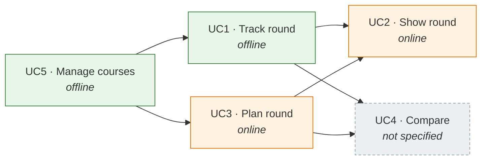
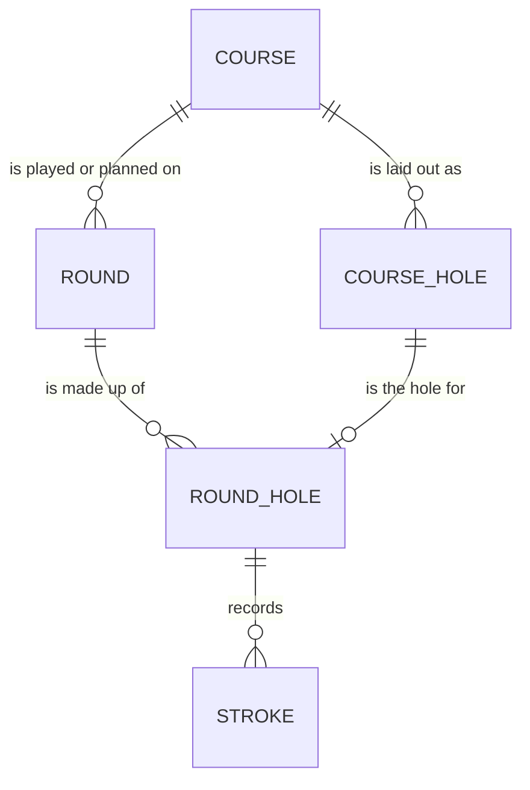

# Use cases

The behaviour specifications for GolfTrainer. `CLAUDE.md` says _what the system
is and why_; these documents say _what it does_, in enough detail to build and
test from. They follow the template of the Business Analyst skill: overview,
trigger, main success scenario, alternative and exception flows, business rules,
data requirements, acceptance criteria.

They are specifications, not a backlog. Where a use case makes a decision that
`CLAUDE.md` had left open, the decision is recorded here **and** in the spine —
see [Decisions these specs settle](#decisions-these-specs-settle).

## The four use cases

| #                            | Name           | Context         | Owns                                        | Status                     |
| ---------------------------- | -------------- | --------------- | ------------------------------------------- | -------------------------- |
| [UC1](UC1-track-round.md)    | Track round    | Course, offline | The played round — strokes as they happen   | Specified, not built       |
| [UC2](UC2-show-round.md)     | Show round     | Couch, online   | Nothing — reads rounds, played and planned  | Specified, not built       |
| [UC3](UC3-plan-round.md)     | Plan round     | Couch, online   | The planned round — intended strokes        | Specified, not built       |
| UC4                          | Compare        | Couch, online   | Nothing — plan against actual               | Not specified — see OPEN-5 |
| [UC5](UC5-manage-courses.md) | Manage courses | Either, offline | The course catalogue — courses, holes, tees | Specified, not built       |

UC4 is deliberately absent. The shared domain model makes it expressible; it is
a scope call, not a design question (OPEN-5 in `CLAUDE.md`).

### Where the mind map's names went

The specs are numbered to match the use case table in `CLAUDE.md §1.1`, not the
order the ideas were written down in.

| Mind map                 | Spec |
| ------------------------ | ---- |
| US3: Shot tracker        | UC1  |
| US4: Show round          | UC2  |
| US2: Round planner       | UC3  |
| Custom course management | UC5  |

## Build order

The arrows are hard dependencies: you cannot start a round without a course, and
you cannot show a round until one exists.



UC5 and UC1 together are the first shippable product: a round captured on the
course with nothing online involved. Everything green here must build and run
with `src/online/` deleted — the acceptance test for the dependency rule.

## The shared domain model

One model, both contexts (`CLAUDE.md §1.4`). A planned stroke and a captured
stroke are the same row with a different `Round.kind`; that is what will make
UC4 a query rather than a project.



```
entity Position {
  latitude: number
  longitude: number
  accuracy: number | null       -- metres, from the GNSS fix; null when planned
  fixedAt: timestamp | null     -- when the device produced the fix
}

entity Course {
  id: string
  name: string
  holeCount: number             -- 9 or 18 (UC5 BR3)
  createdAt: timestamp
}

entity CourseHole {
  id: string
  courseId: string
  number: number                -- 1..Course.holeCount, unique per course
  teePosition: Position | null  -- null until the golfer stands on the tee
}

entity Round {
  id: string
  courseId: string
  kind: "PLAYED" | "PLANNED"
  startedAt: timestamp
  finishedAt: timestamp | null  -- null while the round is in progress
}

entity RoundHole {
  id: string
  roundId: string
  number: number                -- the CourseHole it corresponds to
  startedAt: timestamp
  finishedAt: timestamp | null
  putts: number | null          -- entered as a count when the hole is finished
}

entity Stroke {
  id: string
  roundHoleId: string
  sequence: number              -- 1..n, contiguous, per hole
  club: Club
  position: Position | null     -- null only when no fix was available (UC1 E1)
  recordedAt: timestamp
}
```

`Club` is a fixed enumeration of twelve values — a standard bag, not a
configurable one:

```
Club =
  DRIVER
  IRON_4 | IRON_5 | IRON_6 | IRON_7 | IRON_8 | IRON_9
  PITCHING_WEDGE | GAP_WEDGE | SAND_WEDGE | LOB_WEDGE
  PUTTER
```

Twelve is the number that matters, because it is a car-mode layout before it is
a data type: three columns by four rows of glove-sized targets fits a phone,
where fourteen does not (QG2). Four families, in the order the bag is used —
driver, irons, wedges, putter.

Two consequences worth stating rather than discovering later:

- **No woods and no hybrids.** They are one enum value and one grid cell each
  when the golfer wants them, and a migration that only ever adds values.
- **Adding a club is a migration.** The enumeration is a column on every stroke,
  so it is settled here, before the first table exists, rather than grown.

### Three rules that hold across every use case

- **A stroke's position is where the ball came to rest**, not where it was
  struck from. The start of stroke _n_ is the position of stroke _n-1_; the
  start of stroke 1 is `CourseHole.teePosition`. UC1 and UC3 both obey this, and
  that symmetry is the whole reason UC4 will be cheap.
- **Putts are a count, not strokes.** They have no positions, they are entered
  once when the hole is finished, and they are not rows in `Stroke`.
- **A penalty stroke is a second stroke at the same position.** The golfer
  records it by tapping the club again without moving. That costs no field, no
  button and no extra concept: the ball did not advance, and two strokes at one
  spot is exactly what happened. Everything downstream must respect it —
  in particular UC2 may not merge coincident points, because merging them would
  silently delete the penalty.

## Decisions these specs settle

| Question in `CLAUDE.md`               | Settled where | Decision                                                                                                                                  |
| ------------------------------------- | ------------- | ----------------------------------------------------------------------------------------------------------------------------------------- |
| OPEN-3 — how a stroke is recorded     | UC1 BR1       | One tap: the golfer taps the club they used, standing at the ball. Position comes from the current fix. No start/end pair, no lie.        |
| OPEN-4 — where course data comes from | UC5           | The golfer enters it. No provider, no import, nothing to be online for. Tee positions are captured on the tee or placed on the map later. |
| OPEN-8 — which clubs                  | UC1 BR11      | A fixed bag of twelve: driver, irons 4–9, four wedges, putter. Not configurable, no woods, no hybrids.                                    |
| OPEN-9 — penalty strokes and lie      | UC1 BR12      | A penalty is a second stroke at the same position — no field, no button. Lie is not captured at all.                                      |

## Still open

| #      | Question                                                          | Blocks   |
| ------ | ----------------------------------------------------------------- | -------- |
| OPEN-7 | Which basemap and tile provider (`CLAUDE.md` TD7).                | UC2, UC3 |
| OPEN-5 | Whether plan-versus-actual (UC4) is built, and for which release. | UC4      |
