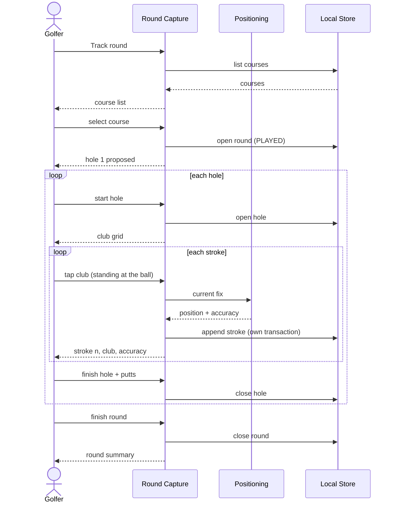

# UC1 — Track round

> The mind map calls this **US3: Shot tracker**. It is the use case the whole
> architecture is shaped around: if this one is not trustworthy offline, nothing
> else in the product is worth building.

## 1. Overview

|                   |                                                                                                                                                                    |
| ----------------- | ------------------------------------------------------------------------------------------------------------------------------------------------------------------ |
| **Use case name** | Track round                                                                                                                                                        |
| **Actor**         | Golfer, playing a round — phone in one hand, glove on, group waiting                                                                                               |
| **Goal**          | Reach the clubhouse with a complete stroke-by-stroke record of the round on the device                                                                             |
| **Scope**         | Offline core only: Round Capture, Positioning, Domain Model, Course Catalogue, Local Store. No map, no network, no online capability — not by import, not by event |
| **Trigger**       | The golfer taps **Track round** in the burger menu, standing on the first tee                                                                                      |

**Stakeholders and interests**

| Stakeholder      | Interest                                                                                   |
| ---------------- | ------------------------------------------------------------------------------------------ |
| Golfer           | Every stroke recorded, nothing lost, no attention stolen from playing                      |
| Playing partners | That capture costs seconds, not a hole's worth of delay — the binding usability constraint |
| Maintainer       | The offline core stays free of online dependencies (§1.4)                                  |
| Data protection  | Position traces are personal data and never leave the device in this use case              |

**Preconditions**

1. The app is installed to the home screen and storage persistence has been
   requested (TD8) — a round captured in a browser tab is the case iOS still
   evicts.
2. At least one course exists in the catalogue (UC5).
3. Location permission is granted. If it is not, see exception E3 — the use case
   degrades, it does not silently misbehave.
4. **No network is assumed at any point.** Airplane mode is the reference
   environment for every acceptance criterion below.

## 2. Main success scenario

1. The golfer opens **Track round**.
2. The system lists the stored courses, most recently played first.
3. The golfer taps a course. The system opens a round (`kind = PLAYED`,
   `startedAt = now`) and proposes hole 1.
4. The golfer taps **Start hole**. The system opens the hole and shows the club
   grid — hole number, strokes so far, and the twelve clubs of the bag as twelve
   large targets, three across and four down (BR11).
5. The golfer plays the stroke, walks to the ball, and taps the club they used.
6. The system takes the current position fix, appends the stroke, and confirms
   it — club and stroke number, large enough to read at arm's length in
   sunlight.
7. Steps 5–6 repeat until the ball is on the green.
8. The golfer taps **Finish hole** and taps the number of putts.
9. The system closes the hole and proposes the next one. Steps 4–8 repeat.
10. After the last hole the golfer taps **Finish round**. The system stores
    `finishedAt` and shows the round summary.

```
flow startRound(courseId) {
  transaction {
    round = rounds.open(courseId, "PLAYED", now)
  }
  return round
}

flow startHole(roundId, number) {
  transaction {
    roundHole = roundHoles.open(roundId, number, now)
  }
  return roundHole
}

flow captureStroke(roundHoleId, club) {
  position = positioning.currentFix()        -- E1 if there is none
  transaction {
    sequence = strokes.nextSequence(roundHoleId)
    strokes.append(roundHoleId, sequence, club, position, now)
  }
  ui.confirm(sequence, club, position.accuracy)
}

flow finishHole(roundHoleId, putts) {
  transaction {
    roundHoles.close(roundHoleId, putts, now)
  }
}

flow finishRound(roundId) {
  transaction {
    rounds.close(roundId, now)
  }
}
```



## 3. Alternative flows

**A1 — Resume an interrupted round.** The app was killed, the battery died, or
the OS evicted the page. On opening **Track round** the system finds a round
with `finishedAt = null`, offers to resume it, and reopens the last unfinished
hole. Everything recorded before the interruption is there; nothing needs
replaying. Declining the offer finishes the old round instead of deleting it.

**A2 — Start somewhere other than hole 1.** At step 3 or 9 the golfer overrides
the proposed hole and picks another. Shotgun starts, a nine-hole loop beginning
at 10, and skipping a hole all land here. Holes are recorded in the order they
are played; the hole number is what identifies them, not the sequence.

**A3 — Undo the last stroke.** A gloved mis-tap is the expected error, not an
exotic one. The confirmation from step 6 offers **Undo** until the next stroke is
recorded or the hole is finished. Undo deletes the last stroke of the hole and
renumbers nothing, because the sequence is contiguous by construction.

**A4 — Correct the club of the last stroke.** As A3, then re-tap. There is no
separate edit; deleting and re-recording is fewer interactions than an editor
would be.

**A5 — A hole with no recorded strokes.** The golfer forgot, or picked up. The
hole is finished with putts only, or with nothing at all. A `RoundHole` with
zero strokes is valid data, not a defect — it says "played, not recorded",
which is true and worth keeping.

**A6 — A penalty stroke.** Water, out of bounds, an unplayable lie: the stroke
counts and the ball did not advance. The golfer records it by **tapping the club
again without moving** — a second stroke, at the same position, on the same
hole. Nothing else changes: no penalty button, no field on `Stroke`, no separate
concept for the map or the totals to handle.

That is exact rather than merely convenient. Two strokes at one spot is what
happened, so the hole's total matches the scorecard, and the route in UC2 shows
a ball that did not move. Where the golfer drops and plays on, the drop is
recorded like any other stroke: they are standing at it when they tap.

The one thing it costs is downstream care — UC2 may not merge coincident points
(UC2 BR8), because merging them would delete the penalty.

| #   | Condition                                            | System response                                                                                                                                                                                         |
| --- | ---------------------------------------------------- | ------------------------------------------------------------------------------------------------------------------------------------------------------------------------------------------------------- |
| E1  | No position fix within 5 seconds of the tap          | The stroke is saved **with the club and no position**, and shown as such. Losing the stroke to protect the data model would be the worse failure (QG3). The golfer can undo it (A3) if it was a mis-tap |
| E2  | The fix is poor (accuracy worse than 20 m)           | The stroke is saved with the fix and its accuracy, and the accuracy is shown. Never a blocking dialog — a group is waiting                                                                              |
| E3  | Location permission denied or revoked                | The system says plainly that positions cannot be recorded, and offers to continue capturing clubs and putts only. It does not pretend the round is complete                                             |
| E4  | `navigator.storage.persist()` was refused (TD8)      | Said plainly before the round starts, once, with the consequence spelled out: the OS may reclaim this round. Not a blocker                                                                              |
| E5  | The write fails — quota exhausted, store unavailable | The stroke is reported as **not** saved, in the same place the confirmation would have appeared. Silence here would mean the golfer trusts a record that does not exist                                 |
| E6  | The app is killed between two strokes                | Nothing is lost: each stroke was committed in its own transaction (BR5). Recovery is A1                                                                                                                 |
| E7  | The golfer opens an online destination mid-round     | Out of scope for this use case, and by TD13 only ever a dynamic import — the capture screen never statically depends on it                                                                              |

## 5. Business rules

| #    | Rule                                                                                                                                                                                                                                                                                                              |
| ---- | ----------------------------------------------------------------------------------------------------------------------------------------------------------------------------------------------------------------------------------------------------------------------------------------------------------------- |
| BR1  | **A stroke's recorded position is where the ball came to rest**, and its club is the club that put it there. The start of stroke _n_ is the position of stroke _n-1_; the start of stroke 1 is the hole's tee position when the catalogue has one. This is the answer to OPEN-3                                   |
| BR2  | **One tap records a stroke.** Tapping the club is the whole interaction — no confirm step, no separate "capture position" action, no typing anywhere in this use case (QG2)                                                                                                                                       |
| BR3  | Putts are entered once, as a count, when the hole is finished. They are not strokes and have no positions                                                                                                                                                                                                         |
| BR4  | A hole's total is `recorded strokes + putts`. The system never invents a stroke to make that total match a scorecard                                                                                                                                                                                              |
| BR5  | Every stroke is committed in its own transaction, at the moment it is tapped. There is no "save round" step, because a save step is a thing that can fail to happen (QG3)                                                                                                                                         |
| BR6  | Stroke sequences are contiguous from 1 within a hole                                                                                                                                                                                                                                                              |
| BR7  | **No network call may occur anywhere in this use case**, and no code path may reach an online capability. Enforced by ESLint (TD10), not by review                                                                                                                                                                |
| BR8  | No map is shown. On the course the golfer is in car mode (TD3)                                                                                                                                                                                                                                                    |
| BR9  | A round has exactly one course and `kind = PLAYED`. This use case never touches a `PLANNED` round                                                                                                                                                                                                                 |
| BR10 | Only one round may be in progress at a time                                                                                                                                                                                                                                                                       |
| BR11 | The grid offers a **fixed bag of twelve** — driver, irons 4 to 9, four wedges, putter — in that order, laid out three across and four down. Not configurable, no woods, no hybrids. Twelve is a QG2 number before it is a data one: fourteen glove-sized targets do not fit a phone. This is the answer to OPEN-8 |
| BR12 | **A penalty stroke is a second stroke at the same position** (A6). `Stroke` has no penalty field and the grid has no penalty button. Lie is not captured at all. This is the answer to OPEN-9                                                                                                                     |
| BR13 | The putter is on the grid, and a stroke recorded with it is one played from **off** the green. Putts on the green stay a count (BR3) — the two are never the same row                                                                                                                                             |

## 6. Data requirements

| Entity                 | This use case                                         |
| ---------------------- | ----------------------------------------------------- |
| `Course`, `CourseHole` | Reads. Never writes — the catalogue is UC5's          |
| `Round`                | Creates, with `kind = PLAYED`; closes at the end      |
| `RoundHole`            | Creates one per hole played; writes `putts` on finish |
| `Stroke`               | Creates, one per tap                                  |

Definitions are in the [shared domain model](README.md#the-shared-domain-model).
The only field this use case may leave null that UC3 never does is
`Stroke.position` — see E1, and note that UC2 has to render around it.

## 7. Acceptance criteria

**AC1 — A round is captured end to end offline**
_Given_ the device is in airplane mode and a course exists,
_when_ the golfer records strokes and putts for every hole and finishes the
round,
_then_ the complete round is stored on the device and no network request is
made at any point.

**AC2 — One tap per stroke**
_Given_ the hole screen is open,
_when_ the golfer taps a club,
_then_ a stroke is recorded with that club and the current fix, with no further
interaction required.

**AC3 — The stroke survives the app dying**
_Given_ three strokes have been recorded on hole 4,
_when_ the app is killed and reopened,
_then_ the round is offered for resume and all three strokes are present with
their clubs and positions.

**AC4 — A cold start in airplane mode works**
_Given_ the app has been installed and the device has never been online since,
_when_ the golfer launches it from the home screen,
_then_ Track round opens and can record a stroke.

**AC5 — No fix does not mean no stroke**
_Given_ the device cannot produce a fix,
_when_ the golfer taps a club,
_then_ the stroke is saved with the club and no position, and is shown as
missing its position.

**AC6 — A poor fix is recorded, not rejected**
_Given_ the fix has an accuracy of 35 m,
_when_ the golfer taps a club,
_then_ the stroke is saved with that fix, the accuracy is visible, and nothing
blocks the next stroke.

**AC7 — Denied permission is stated, not worked around**
_Given_ location permission is denied,
_when_ the golfer starts a round,
_then_ the system says positions cannot be recorded and offers to continue with
clubs and putts only.

**AC8 — A mis-tap can be undone**
_Given_ the golfer has just tapped the wrong club,
_when_ they tap Undo before recording the next stroke,
_then_ the stroke is removed and the hole's stroke count drops by one.

**AC9 — Putts complete the hole**
_Given_ four strokes are recorded on hole 7,
_when_ the golfer finishes the hole with 2 putts,
_then_ the hole totals 6 and the round advances to hole 8.

**AC10 — A penalty costs one extra tap and nothing else**
_Given_ the golfer has hit into water and is standing where they played from,
_when_ they tap the same club a second time without moving,
_then_ two strokes exist for that hole at effectively the same position, the
hole's total is two higher, and no penalty-specific data was stored.

**AC11 — Every club in the bag is reachable with a glove**
_Given_ the hole screen is open,
_when_ the twelve targets are measured,
_then_ all twelve are visible without scrolling and each is at least 48 px in
both dimensions.

**AC12 — The offline core stands alone**
_Given_ `src/online/` is deleted,
_when_ the build and the offline suite run,
_then_ both pass and this use case is fully exercised.

## 8. Open questions

- Should the course list be ordered by proximity when a fix is available? It
  would save a scroll, and Positioning is already on this screen. Not specified
  here because it is a refinement of step 2, not a change to it.
