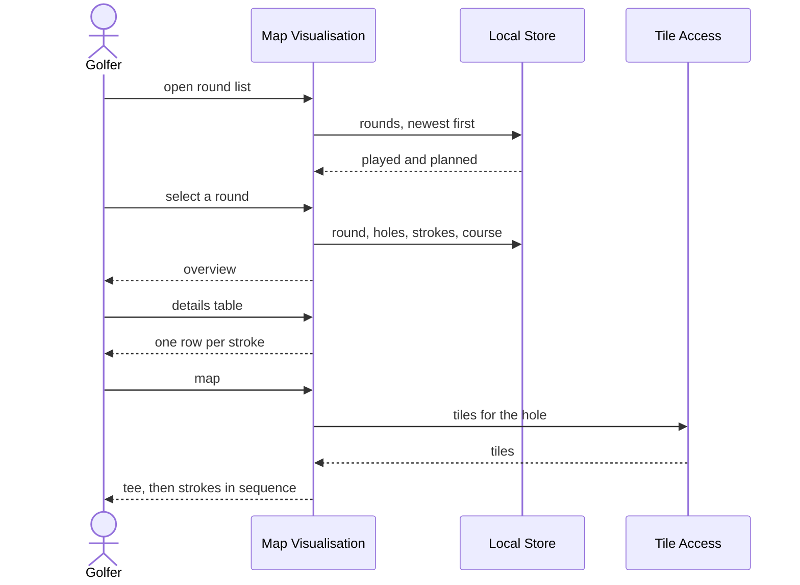

# UC2 — Show round

> The mind map calls this **US4: Show round**. It is the use case that pays for
> UC1: capture is a chore, and this is the thing that makes the chore worth
> doing.

## 1. Overview

|                   |                                                                                                                             |
| ----------------- | --------------------------------------------------------------------------------------------------------------------------- |
| **Use case name** | Show round                                                                                                                  |
| **Actor**         | Golfer at home, online, reviewing                                                                                           |
| **Goal**          | Understand a round — played or planned — at three levels: a summary, a table of every stroke, and the route on a map        |
| **Scope**         | Online capabilities: Map Visualisation, Tile Access. Reads the shared Domain Model and the Course Catalogue. Writes nothing |
| **Trigger**       | The golfer opens a round from the round list, or from the summary shown at the end of UC1 or UC3                            |

**Stakeholders and interests**

| Stakeholder          | Interest                                                                    |
| -------------------- | --------------------------------------------------------------------------- |
| Golfer               | To see where the ball actually went, which is the record no scorecard keeps |
| Maintainer           | A read-only use case that cannot corrupt a round it is displaying           |
| Map/basemap provider | Attribution shown, tiles fetched for viewing and not harvested (§1.2)       |

**Preconditions**

1. At least one round exists — captured (UC1) or planned (UC3).
2. The device is online for the map. The overview and the table need no network;
   see BR6 for why they are nonetheless in the online half today.

## 2. Main success scenario

1. The golfer opens the round list. It shows played and planned rounds together,
   most recent first, each labelled with its course, date and kind.
2. The golfer selects a round.
3. The system shows the **overview**: course, date, kind, total strokes, total
   putts, holes recorded, and a strokes-and-putts figure per hole.
4. The golfer switches to the **details table**: one row per stroke — hole,
   stroke number, club, position, accuracy — with putts shown per hole.
5. The golfer switches to the **map**: the route of a hole drawn tee first, then
   each stroke position in sequence, with the club at each point.
6. The golfer steps from hole to hole on the map.

```
flow showRound(roundId) {
  round = rounds.byId(roundId)
  course = courses.byId(round.courseId)
  holes = roundHoles.byRound(roundId)
  strokes = strokes.byRound(roundId)
  return Overview(round, course, holes, strokes)
}

flow routeOfHole(roundId, number) {
  hole = roundHoles.byNumber(roundId, number)
  tee = courseHoles.teePosition(course.id, number)
  points = strokes.byHole(hole.id)
    .ordered(by: sequence)
    .where(position is not null)      -- E2
  return Route(tee, points)
}
```



## 3. Alternative flows

**A1 — Show a planned round.** Identical, with one difference: planned strokes
have no accuracy and no fix time, so those columns are empty rather than zero.
The map draws the intended route the same way it draws the actual one.

**A2 — Show a round still in progress.** A round with `finishedAt = null` is
viewable. Totals are "so far", and the round is labelled as unfinished rather
than shown as a short round.

**A3 — Show a hole rather than a round.** From the table or the per-hole
figures, the golfer jumps straight to that hole's map.

**A4 — Compare with the plan.** Out of scope. This is UC4, gated on OPEN-5.

## 4. Exception flows

| #   | Condition                                           | System response                                                                                                                                                                                                                                                                  |
| --- | --------------------------------------------------- | -------------------------------------------------------------------------------------------------------------------------------------------------------------------------------------------------------------------------------------------------------------------------------- |
| E1  | No rounds exist                                     | The list says so and points at Track round and Plan round, rather than showing an empty table                                                                                                                                                                                    |
| E2  | A stroke has no position (UC1 E1)                   | It appears in the table with its club and an explicit "no position", and is **skipped** on the map — the route joins the strokes either side of it and says a point is missing. Drawing a straight line through a gap without saying so would be a lie about where the ball went |
| E3  | The hole has no tee position                        | The route starts at the first stroke instead, and says the tee is unknown                                                                                                                                                                                                        |
| E4  | Offline                                             | The map cannot be drawn and says so. What happens to the overview and table is BR6                                                                                                                                                                                               |
| E5  | The tile provider fails                             | Reported. The route is still drawn on whatever the map can render, because the geometry is local data                                                                                                                                                                            |
| E6  | A hole was played with no strokes recorded (UC1 A5) | Shown as "not recorded", with its putts if there are any. Not as a zero                                                                                                                                                                                                          |
| E7  | The course lies outside the orthophoto coverage     | The map falls back to OSM standard tiles and says that no imagery is available here. A silent fallback would read as a failed load, and the golfer would keep waiting for a photo that is never coming (TD7a)                                                                    |

## 5. Business rules

| #   | Rule                                                                                                                                                                                                                                                                                                 |
| --- | ---------------------------------------------------------------------------------------------------------------------------------------------------------------------------------------------------------------------------------------------------------------------------------------------------- |
| BR1 | This use case is read-only. It never edits, repairs or normalises a round it displays                                                                                                                                                                                                                |
| BR2 | Played and planned rounds are shown by the same views. One model, one renderer                                                                                                                                                                                                                       |
| BR3 | A hole's route is: tee position, then every stroke position in sequence order. Putts add no points                                                                                                                                                                                                   |
| BR4 | Totals are computed from what is stored, never adjusted to look plausible. A round is shown as it was recorded                                                                                                                                                                                       |
| BR5 | Positions are shown with their accuracy, so the golfer can tell a 3 m fix from a 40 m one                                                                                                                                                                                                            |
| BR6 | The overview and the table need no network, but they live in the online half for now. Making them reachable on the course would mean moving them into the offline core, and nothing in UC1 asks for that — car mode (TD3) is the on-course experience. This is a decision, not an oversight          |
| BR7 | Basemap attribution is visible wherever tiles are shown, and it names whichever layer is actually being drawn — the imagery is CC BY 4.0, so naming the source is a licence obligation and not a courtesy (TD7a)                                                                                     |
| BR8 | **Coincident stroke positions are never merged.** Two strokes at one spot is how a penalty is recorded (UC1 A6), so a map that collapses them into one marker deletes a stroke the golfer took. They are drawn as a stack carrying the count, and the table lists them as the separate rows they are |

## 6. Data requirements

| Entity                         | This use case                                      |
| ------------------------------ | -------------------------------------------------- |
| `Round`, `RoundHole`, `Stroke` | Reads only                                         |
| `Course`, `CourseHole`         | Reads only — name, and tee positions for the route |

No entity is created or modified. If a query here needs a field the model does
not have, the fix is a change to the model with UC1 and UC3 in view, not a
private extension for the viewer.

## 7. Acceptance criteria

**AC1 — A captured round is shown at all three levels**
_Given_ a completed round of 18 holes,
_when_ the golfer opens it,
_then_ the overview shows the per-hole totals, the table shows one row per
recorded stroke with its club, and the map draws each hole's route in sequence
from the tee.

**AC2 — Planned and played rounds use the same views**
_Given_ a planned round,
_when_ the golfer opens it,
_then_ the same overview, table and map appear, with accuracy blank and the
round labelled as planned.

**AC3 — A stroke without a position is visible, not hidden**
_Given_ a round in which stroke 2 of hole 3 has no position,
_when_ the golfer views hole 3,
_then_ the table shows the stroke with its club and "no position", and the map
states that a point is missing rather than drawing through it.

**AC4 — An unfinished round is legible**
_Given_ a round abandoned after 7 holes,
_when_ the golfer opens it,
_then_ it is labelled unfinished and the totals cover the 7 holes played.

**AC5 — Nothing is written**
_Given_ any round,
_when_ the golfer views it in every view and closes it,
_then_ the stored round is byte-for-byte unchanged.

**AC6 — Offline is stated, not faked**
_Given_ the device is offline,
_when_ the golfer opens Show round,
_then_ the system says the screen needs a network and does not open a partial
version of itself.

> Refined during implementation. This use case lives in the online half (BR6),
> so its modules are not precached and it cannot open offline at all — the
> refusal happens at the door rather than at the map. Making the overview and
> table reachable on the course would mean moving them into the offline core,
> which is the decision BR6 declines to make.

**AC7 — A penalty is visible as two strokes, not one**
_Given_ a hole where strokes 2 and 3 were recorded at the same position (UC1
A6),
_when_ the golfer views that hole,
_then_ the table shows both rows, the map marks the spot as carrying two
strokes, and the hole's total counts both.

## 8. Open questions

- Whether the imagery is worth it on the golfer's own course. The orthophotos
  are 20 cm and reflown every few years, which should show fairway, bunker and
  green outlines clearly — but that is an expectation until someone opens their
  home club and looks (TD7a).
- **OPEN-5** — whether plan-versus-actual (UC4) is built, and whether it is a
  fourth view here or a use case of its own.
- Should distances between strokes be derived and shown? It is the first thing
  the data makes possible and the first thing accuracy makes questionable — a
  40 m fix makes a "142 m drive" a fiction.
