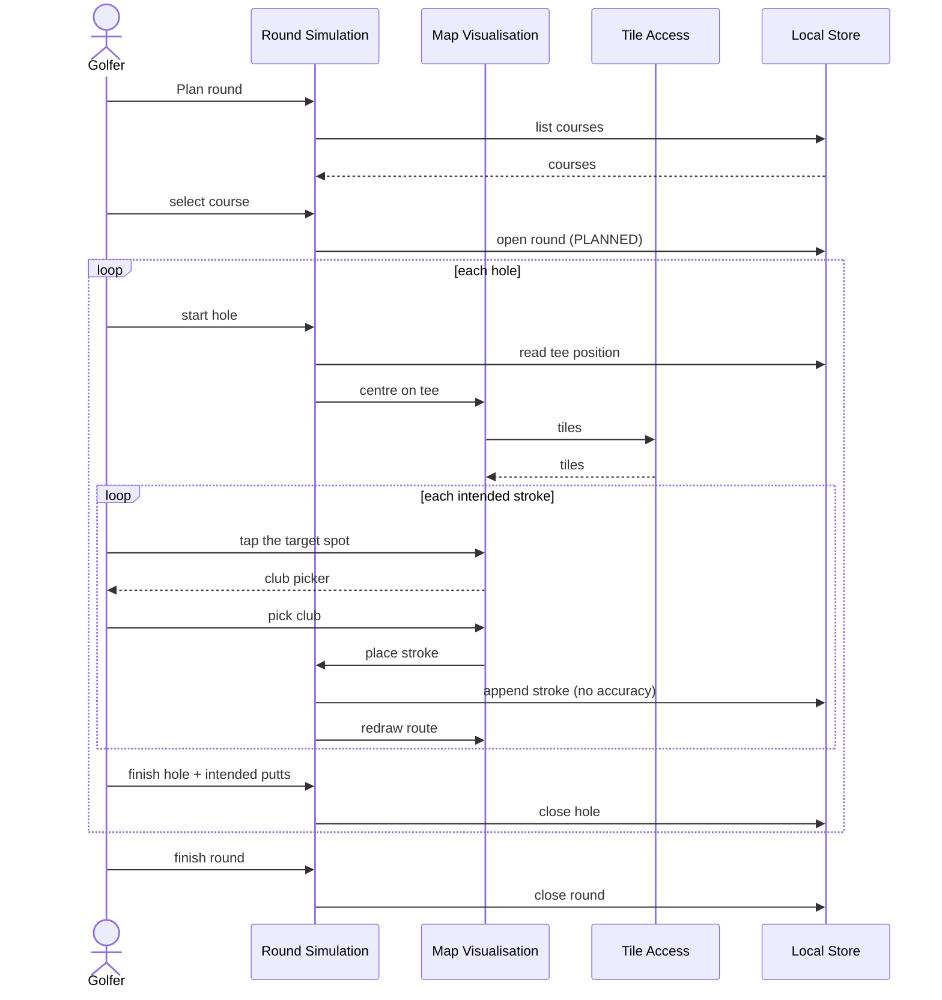

# UC3 — Plan round

> The mind map calls this **US2: Round planner**. It is UC1 done backwards: the
> same strokes, placed by hand on a map before the round instead of captured by
> GNSS during it.

## 1. Overview

|                   |                                                                                                                                                                                      |
| ----------------- | ------------------------------------------------------------------------------------------------------------------------------------------------------------------------------------ |
| **Use case name** | Plan round                                                                                                                                                                           |
| **Actor**         | Golfer at home, online, with time and a real screen                                                                                                                                  |
| **Goal**          | Have an intended route through each hole — where the ball should come to rest, and with which club — that a played round can later be measured against                               |
| **Scope**         | Online capabilities: Round Simulation, Map Visualisation, Tile Access. Writes through the shared Domain Model and reads the Course Catalogue, both of which live in the offline core |
| **Trigger**       | The golfer taps **Plan round** in the burger menu                                                                                                                                    |

**Stakeholders and interests**

| Stakeholder          | Interest                                                                  |
| -------------------- | ------------------------------------------------------------------------- |
| Golfer               | A plan worth following, and later worth comparing against                 |
| Maintainer           | That the planner depends on the offline core and never the reverse (§1.4) |
| Map/basemap provider | Attribution shown, terms honoured, no bulk tile fetching (§1.2)           |

**Preconditions**

1. The device is online. This use case has no offline mode and does not pretend
   to — map availability offline is an explicit non-goal (`CLAUDE.md §1.1`).
2. The course exists in the catalogue (UC5).
3. Ideally the holes have tee positions, so the map can open on the right part
   of the world. See A2 for when they do not.

## 2. Main success scenario

1. The golfer opens **Plan round**.
2. The system lists the stored courses.
3. The golfer taps a course. The system opens a round with `kind = PLANNED` and
   `startedAt = now`, and proposes hole 1.
4. The golfer taps **Start hole**. The system opens the hole and centres the map
   on that hole's tee position.
5. The golfer taps the map where they intend the ball to come to rest, then
   picks the club they intend to use.
6. The system appends the stroke — the tapped coordinates as its position, no
   accuracy, no fix time — draws the route so far (tee, then each stroke in
   order), and shows **how far each stroke has to carry**: the first from the
   tee, the rest from where the previous stroke leaves the ball (BR10).
7. Steps 5–6 repeat until the plan reaches the green.
8. The golfer taps **Finish hole** and enters the intended number of putts.
9. The system closes the hole and proposes the next. Steps 4–8 repeat.
10. The golfer finishes the round. The plan is stored and can be opened in UC2.

```
flow startPlannedRound(courseId) {
  transaction {
    round = rounds.open(courseId, "PLANNED", now)
  }
  return round
}

flow placeStroke(roundHoleId, latitude, longitude, club) {
  position = Position(latitude, longitude, accuracy: null, fixedAt: null)
  transaction {
    sequence = strokes.nextSequence(roundHoleId)
    strokes.append(roundHoleId, sequence, club, position, now)
  }
  map.drawRoute(roundHoleId)
}
```



## 3. Alternative flows

**A1 — Move or remove a placed stroke.** Planning is iterative in a way capture
is not: there is no group waiting. The golfer may drag a placed stroke to a new
spot, change its club, or delete it. Deleting a stroke closes the gap in the
sequence, which stays contiguous (BR6 of UC1 holds here too).

**A2 — The hole has no tee position.** The map cannot centre itself. The system
asks the golfer to place the tee, writes it to the course catalogue through UC5,
and continues. Planning is the one context where placing a tee on a map is
easier than standing on it.

**A3 — Continue an unfinished plan.** A plan left half-finished is offered for
resume, exactly as a played round is (UC1 A1). Plans are not expected to be
completed in one sitting.

**A4 — Re-plan a hole.** The golfer clears a hole's strokes and starts it again.
The `RoundHole` survives; its strokes do not.

## 4. Exception flows

| #   | Condition                                                            | System response                                                                                                                                                          |
| --- | -------------------------------------------------------------------- | ------------------------------------------------------------------------------------------------------------------------------------------------------------------------ |
| E1  | The device is offline                                                | The planner refuses to open and says why: it needs the map, and the map is online only. It does not open a mapless degraded mode — that is car mode, and car mode is UC1 |
| E2  | The connection drops mid-plan                                        | Strokes already placed are saved; the store is local, so nothing is lost. Tiles stop loading and the system says so rather than showing empty grey squares               |
| E3  | The tile provider fails or rate-limits                               | Reported plainly. The plan is not corrupted by the absence of a basemap                                                                                                  |
| E4  | The golfer taps a spot implausibly far from the tee (more than 1 km) | Accepted, but flagged. A mis-tap on a zoomed-out map is easy and expensive to notice later                                                                               |
| E5  | The store write fails                                                | The stroke is reported as not placed and is not drawn. The map never shows a stroke the store does not have                                                              |
| E6  | The imagery service will not load tiles                              | Reported, with the layer switcher named. Planning on a street map is worse but not impossible; pretending the imagery is still loading would be worse still (TD7a)       |

## 5. Business rules

| #    | Rule                                                                                                                                                                                                                                                                                                                                                                                                                           |
| ---- | ------------------------------------------------------------------------------------------------------------------------------------------------------------------------------------------------------------------------------------------------------------------------------------------------------------------------------------------------------------------------------------------------------------------------------ |
| BR1  | A planned stroke's position is where the ball is **intended to come to rest** — identical semantics to a captured stroke (UC1 BR1). That symmetry is what makes UC4 a query                                                                                                                                                                                                                                                    |
| BR2  | A planned stroke has `accuracy = null` and `fixedAt = null`. Those two nulls are how a plan is told apart from a capture at the field level, and `Round.kind` is how it is told apart at the round level                                                                                                                                                                                                                       |
| BR3  | Planning never writes to a round with `kind = PLAYED`, and capture never writes to a `PLANNED` one                                                                                                                                                                                                                                                                                                                             |
| BR4  | A course may have any number of plans. A plan is not a property of a course                                                                                                                                                                                                                                                                                                                                                    |
| BR5  | Planned putts are an intention, stored in the same field as recorded putts                                                                                                                                                                                                                                                                                                                                                     |
| BR6  | The planner may read and write the offline core's domain model. The offline core may not know the planner exists — no import, no event, no shared type carrying a map concern (§1.4, enforced by TD10)                                                                                                                                                                                                                         |
| BR7  | Basemap attribution is visible wherever tiles are shown, naming the layer actually drawn. The imagery is CC BY 4.0, so this is a licence obligation and not a courtesy (TD7a)                                                                                                                                                                                                                                                  |
| BR8  | The club picker offers the same twelve clubs as the capture grid (UC1 BR11), from the same enumeration. It need not use the same layout — there is no glove and no group waiting here                                                                                                                                                                                                                                          |
| BR9  | A plan contains no penalty strokes. A penalty is a second stroke at the same position (UC1 A6), which is a thing that happens, not a thing anyone intends. Nothing forbids placing two strokes on one spot; it is simply never the point of a plan                                                                                                                                                                             |
| BR10 | **Every planned stroke shows the distance it has to carry**, in metres: the first measured from the hole's tee position, each later one from the stroke before it. This is the same "where the ball came to rest" chain the model rests on (UC1 BR1). Without a tee position the first leg is unknown and says so rather than measuring from the wrong end; a stroke with no position breaks the chain rather than bridging it |

## 6. Data requirements

| Entity       | This use case                                                      |
| ------------ | ------------------------------------------------------------------ |
| `Course`     | Reads                                                              |
| `CourseHole` | Reads; writes `teePosition` only via A2, which delegates to UC5    |
| `Round`      | Creates, with `kind = PLANNED`                                     |
| `RoundHole`  | Creates one per hole planned; writes intended `putts`              |
| `Stroke`     | Creates, updates and deletes — unlike UC1, which only ever appends |

## 7. Acceptance criteria

**AC1 — A hole is planned on the map**
_Given_ an online golfer with a course whose holes have tee positions,
_when_ they place three strokes on hole 1 and finish it with 2 putts,
_then_ the hole is stored with three strokes in order, each with a club and a
position, and 2 putts.

**AC2 — A planned stroke is distinguishable from a captured one**
_Given_ a stroke placed on the map,
_when_ it is read back from the store,
_then_ its accuracy and fix time are null and its round's kind is `PLANNED`.

**AC3 — The planner refuses to run offline**
_Given_ the device is offline,
_when_ the golfer opens Plan round,
_then_ the system explains that planning needs the map and does not open a
mapless fallback.

**AC4 — A placed stroke can be moved**
_Given_ a stroke placed at the wrong spot,
_when_ the golfer drags it,
_then_ its stored position changes and its sequence and club do not.

**AC5 — A missing tee position is resolved, not worked around**
_Given_ hole 5 has no tee position,
_when_ the golfer starts planning it,
_then_ the system asks them to place the tee and stores it in the course
catalogue, so UC1 has it on the course.

**AC6 — Each stroke shows the distance it has to carry**
_Given_ a hole with a tee position,
_when_ the golfer places two strokes,
_then_ the first shows its distance from the tee, the second shows its distance
from the first, and the hole's total is the sum of the two.

**AC7 — Moving a stroke moves its distance**
_Given_ a placed stroke showing a distance,
_when_ the golfer drags it further from the tee,
_then_ the distance shown changes to match.

**AC8 — The offline core does not learn about the planner**
_Given_ the whole of `src/online/` is deleted,
_when_ the build and the offline suite run,
_then_ both pass.

## 8. Open questions

- Placing a stroke needs a tap accurate to a few metres on imagery zoomed to a
  fairway. Whether that is comfortable on a phone, or whether planning is
  effectively a larger-screen activity, is a thing to find out by using it.
- Does a plan target a specific date or upcoming round, or is it just "a plan
  for this course"? The model says the latter. UC4 may want the former.
