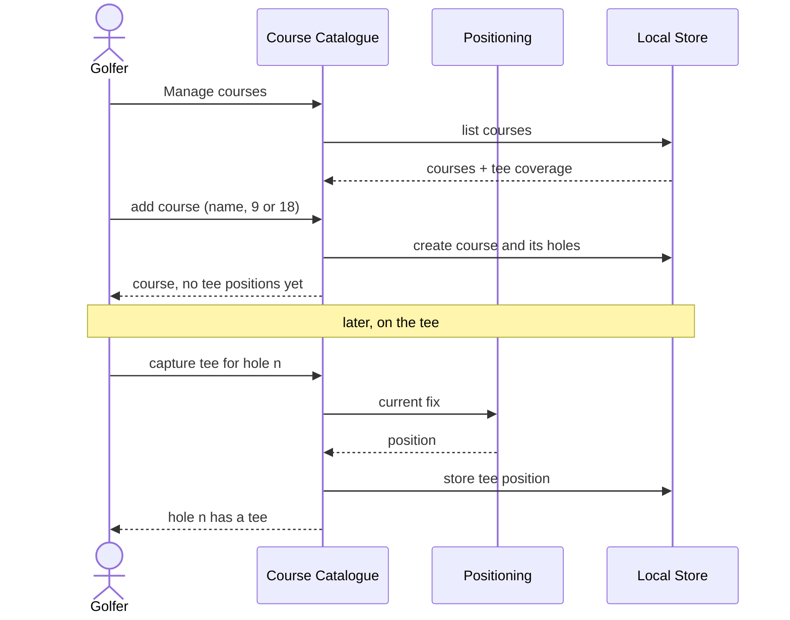

# UC5 — Manage courses

> The mind map calls this **Custom course management**. It is the answer to
> OPEN-4 in `CLAUDE.md`: course data comes from the golfer. There is no
> provider, no import, and therefore nothing on the offline critical path that
> needs a network.

## 1. Overview

|                   |                                                                                                                                                                         |
| ----------------- | ----------------------------------------------------------------------------------------------------------------------------------------------------------------------- |
| **Use case name** | Manage courses                                                                                                                                                          |
| **Actor**         | Golfer — at home before the round, or standing on a tee during one                                                                                                      |
| **Goal**          | Have the courses they play stored on the device: a name, a number of holes, and the tee positions that give the map and the first stroke somewhere to start             |
| **Scope**         | Course Catalogue and Local Store, both in the shared foundation, plus Positioning for capturing a tee. Offline throughout                                               |
| **Trigger**       | The golfer taps **Manage courses** in the burger menu — or is sent here by UC1, which will not start a round without a course, or by UC3 A2, which needs a tee position |

**Stakeholders and interests**

| Stakeholder     | Interest                                                                                                              |
| --------------- | --------------------------------------------------------------------------------------------------------------------- |
| Golfer          | To add a course in under a minute and start playing, without waiting for tee positions they do not have yet           |
| Maintainer      | That the catalogue stays in the offline core, which is what OPEN-4 was really about                                   |
| Data protection | Course positions are recorded at the golfer's home club and are personal data by association. They stay on the device |

**Preconditions**

None. This is the entry point of the whole product: with an empty catalogue,
this is the only use case that can do anything.

## 2. Main success scenario

1. The golfer opens **Manage courses**. The system lists the stored courses with
   their hole count and how many tee positions each has.
2. The golfer taps **Add course**.
3. The golfer types the name and taps **9** or **18**.
4. The system creates the course and its holes, numbered 1 to the hole count,
   each with no tee position yet.
5. The course is immediately usable: UC1 can start a round on it.
6. Later — typically standing on each tee — the golfer opens the course, taps a
   hole, and taps **Capture tee**.
7. The system takes the current fix and stores it as that hole's tee position.

```
flow addCourse(name, holeCount) {
  if courses.existsWithName(name)
    fail "A course with that name already exists"
  transaction {
    course = courses.add(name, holeCount, now)
    for number in 1..holeCount
      courseHoles.add(course.id, number, teePosition: null)
  }
  return course
}

flow captureTee(courseId, number) {
  position = positioning.currentFix()          -- E2 if there is none
  transaction {
    courseHoles.setTeePosition(courseId, number, position)
  }
}

flow deleteCourse(courseId) {
  if rounds.existForCourse(courseId)
    fail "Rounds were played or planned on this course"
  transaction {
    courseHoles.deleteByCourse(courseId)
    courses.delete(courseId)
  }
}
```



## 3. Alternative flows

**A1 — Add tee positions while playing.** The golfer starts a round on a course
with no tee positions at all (step 5) and fills them in over the following
rounds, one tee at a time. This is the expected path, not a fallback: requiring
eighteen positions before the first round would mean walking the course twice.

**A2 — Place a tee on the map.** From the couch, online, the golfer places or
corrects a tee position on the map instead of standing on it. This is the same
write, reached from UC3 A2. It is an online convenience over an offline
capability, which is the dependency direction §1.4 requires.

**A3 — Correct a tee position.** Capturing again overwrites. There is no history
of tee positions; a tee that moved was never two places.

**A4 — Rename a course.** Allowed at any time, including after rounds have been
played on it. Rounds reference the course, not its name.

**A5 — Delete a course.** Allowed only while no round references it. See E3.

**A6 — A course with a hole count other than 9 or 18.** Not supported. See
BR3 and the open question below.

## 4. Exception flows

| #   | Condition                                          | System response                                                                                                                                                                                                                       |
| --- | -------------------------------------------------- | ------------------------------------------------------------------------------------------------------------------------------------------------------------------------------------------------------------------------------------- |
| E1  | The name is empty or duplicates an existing course | Refused, with the reason. Two courses called "Home" is a way to lose a round                                                                                                                                                          |
| E2  | No fix when capturing a tee                        | Said plainly, with a retry. The tee position stays null and the course stays usable — unlike a stroke (UC1 E1), a tee that goes unrecorded now can be recorded on the next round, so there is nothing to salvage by storing a bad one |
| E3  | Delete attempted on a course with rounds           | Refused, naming how many rounds would be lost. Deleting the course would delete the record of rounds that were actually played, which QG3 exists to prevent                                                                           |
| E4  | Location permission denied                         | Tee capture is unavailable and says so. Adding and naming courses still works, and A2 remains                                                                                                                                         |
| E5  | The store write fails                              | Reported as failed. A course that appears in the list but is not stored would break the next round the golfer starts                                                                                                                  |

## 5. Business rules

| #   | Rule                                                                                                                                                                 |
| --- | -------------------------------------------------------------------------------------------------------------------------------------------------------------------- |
| BR1 | Course data is entered by the golfer. There is no provider, no import and no network in this use case — that is the resolution of OPEN-4                             |
| BR2 | A course is usable as soon as it has a name and a hole count. Tee positions are optional, always, and forever                                                        |
| BR3 | A course has 9 or 18 holes, chosen with two large buttons rather than typed                                                                                          |
| BR4 | Hole numbers are 1..`holeCount`, contiguous, and unique within a course. They are created with the course and never added or removed afterwards                      |
| BR5 | A course cannot be deleted while a round references it                                                                                                               |
| BR6 | Typing is acceptable here — a course name is typed once, on the couch or before the first tee. QG2's no-typing rule governs capture during play (UC1 BR2), not setup |
| BR7 | This use case runs offline. The map-based variant A2 is an online addition that writes the same field, never a replacement                                           |

## 6. Data requirements

| Entity            | This use case                                           |
| ----------------- | ------------------------------------------------------- |
| `Course`          | Creates, renames, deletes. **Owns**                     |
| `CourseHole`      | Creates with the course; writes `teePosition`. **Owns** |
| `Round`, `Stroke` | Reads only, and only to refuse a delete (E3)            |

The catalogue is in the shared foundation (§1.4), so it is on the offline
critical path by definition. Everything above must work in airplane mode.

## 7. Acceptance criteria

**AC1 — A course is added offline in one screen**
_Given_ the device is in airplane mode and the catalogue is empty,
_when_ the golfer enters a name and taps 18,
_then_ the course exists with 18 holes numbered 1 to 18, each without a tee
position.

**AC2 — A new course is immediately playable**
_Given_ a course that has just been added and has no tee positions,
_when_ the golfer opens Track round,
_then_ the course is selectable and a round can be started on it.

**AC3 — A tee is captured from the current fix**
_Given_ the golfer is standing on the third tee with a valid fix,
_when_ they tap Capture tee for hole 3,
_then_ hole 3's tee position is stored with that fix.

**AC4 — Capturing again overwrites**
_Given_ hole 3 already has a tee position,
_when_ the golfer captures it again from a different spot,
_then_ the stored position is the new one and there is exactly one.

**AC5 — A duplicate name is refused**
_Given_ a course named "Gut Kaden",
_when_ the golfer adds another with the same name,
_then_ it is refused and the reason is shown.

**AC6 — A course with rounds cannot be deleted**
_Given_ a course with two played rounds,
_when_ the golfer deletes it,
_then_ the deletion is refused, the number of affected rounds is named, and the
course and its rounds are untouched.

**AC7 — No fix does not block the course**
_Given_ no position fix is available,
_when_ the golfer taps Capture tee,
_then_ the failure is stated, the tee position stays empty, and the course
remains usable.

**AC8 — The catalogue survives an update**
_Given_ courses stored under an earlier schema,
_when_ the app updates and migrations run,
_then_ every course, hole and tee position is still there.

## 8. Open questions

- Are hole counts other than 9 and 18 needed? A short course or a 6-hole loop
  would break BR3. Two buttons is the cheapest thing that covers the golfer's
  own courses; a number field is the cheapest thing that covers all of them.
- Should a course record more than tees — green centres, par, stroke index? Par
  is what would make UC2's overview say something about the round rather than
  just counting. Out of scope until UC2 asks for it.
- Sharing a course between devices is OPEN-6's problem, not this one's.
